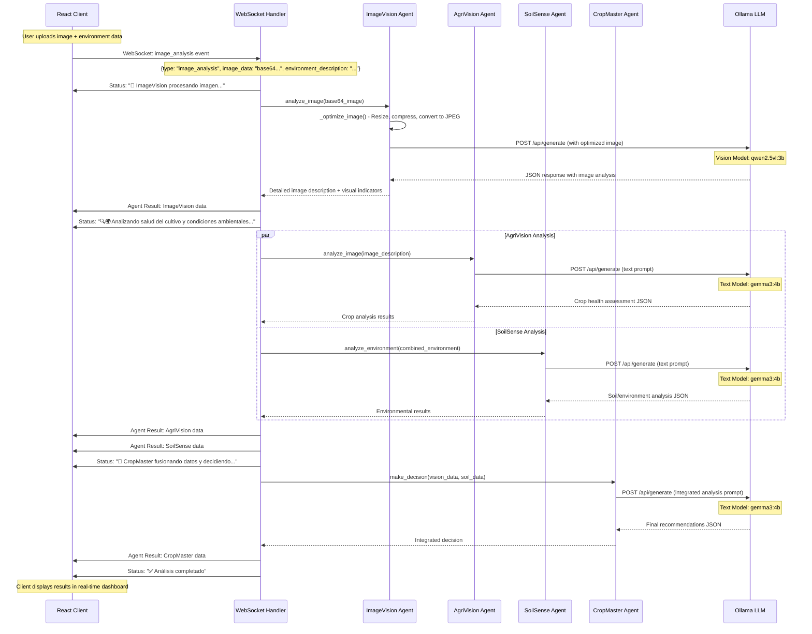
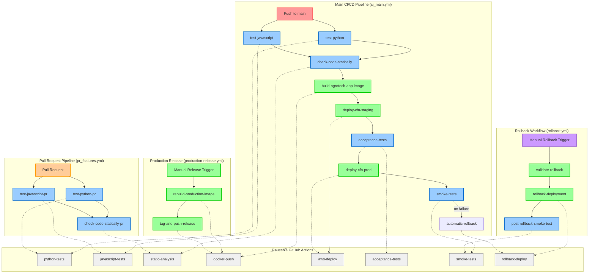
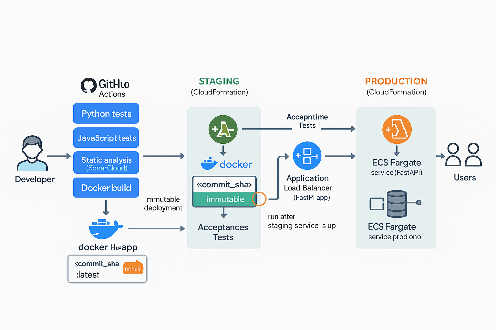

# AgroTech AI - Agricultural Monitoring System

An intelligent agricultural monitoring system powered by AI agents that analyze crop images, soil health, and environmental factors in real-time. The system uses multiple specialized AI agents to provide comprehensive agricultural insights and automated decision-making through image analysis.

## 🧪 **Proof of Concept**

> **Note:** This project is a **proof of concept** demonstrating multi-agent AI systems for agricultural monitoring. It was developed using **vibecoding** - an iterative, AI-assisted development approach that emphasizes rapid prototyping and continuous refinement.

### **Vibecoding Development Process**
- **AI-Assisted Architecture**: System design and implementation guided by AI collaboration
- **Rapid Iteration**: Quick prototyping with immediate testing and refinement
- **Continuous Enhancement**: Features evolved through iterative development cycles
- **Real-time Problem Solving**: Issues addressed as they emerged during development

### **Educational Purpose**

- 📚 **Learning Tool**: Demonstrates modern AI agent architectures
- 🔬 **Research Platform**: Explores multi-agent coordination in agricultural contexts
- 💡 **Innovation Showcase**: Illustrates possibilities of AI-driven agricultural analysis
- 🚀 **Foundation**: Base for future agricultural AI development

*Built with curiosity, refined through collaboration, powered by AI innovation.*

---

## 🌟 Features

- **Multi-Agent AI System**: Four specialized AI agents working together
  - **ImageVision**: Advanced image analysis of uploaded agricultural photos
  - **AgriVision**: Visual analysis of crop health and pest detection
  - **SoilSense**: Environmental conditions and soil analysis  
  - **CropMaster**: Integrated decision-making and recommendations
- **Image Upload & Analysis**: Drag-and-drop image upload with real-time AI analysis
- **Real-time Monitoring**: Live data processing and WebSocket communication
- **Interactive Dashboard**: React-based frontend with real-time visualizations
- **Docker Support**: Containerized deployment with docker-compose
- **Advanced Logging**: Comprehensive logging system for monitoring and debugging

## 🏗️ Architecture

This project follows a **layered client-server architecture** with **multi-agent AI coordination**, designed for both development flexibility and production efficiency:

```
AgroTech AI/
├── 🌐 client/                    # FRONTEND LAYER - React Application
│   ├── src/                      # Application source code
│   │   ├── components/           # Reusable UI components
│   │   │   ├── app.jsx          # 🏠 Main application with agent coordination
│   │   │   ├── ScenarioForm.jsx # 📝 Image upload and environment form
│   │   │   └── ImageUpload.jsx  # 📎 Drag-and-drop upload component
│   │   └── utils/               # Utility functions and helpers
│   │       ├── websocket-utils.js   # 🔌 WebSocket connection management
│   │       └── websocket-config.js  # ⚙️ Environment-aware URL configuration
│   ├── tests/                    # Frontend testing suite
│   │   ├── unit/                # Component and utility tests
│   │   ├── integration/         # Cross-component workflow tests
│   │   ├── test-setup.js        # Jest/Vitest configuration
│   │   └── test-styles.css      # Mock styles for testing
│   ├── Dockerfile               # 🐳 Development container configuration
│   ├── package.json             # Node.js dependencies and scripts
│   ├── vite.config.js          # Build tool configuration
│   ├── tailwind.config.js      # Tailwind CSS configuration
│   └── .eslintrc.json          # Code quality rules
│
├── 🚀 server/                    # BACKEND LAYER - FastAPI Application
│   ├── agrotech_ai/             # Main Python package
│   │   ├── __init__.py         # Package initialization
│   │   ├── app.py              # 🏃 FastAPI application and routing
│   │   ├── agents.py           # 🤖 Multi-agent AI system implementation
│   │   ├── ollama_client.py    # 🧠 Ollama LLM client and session management
│   │   └── websocket_handler.py # 🔌 Real-time communication handler
│   ├── tests/                   # Backend testing suite
│   │   ├── unit/               # Service and component tests
│   │   ├── integration/        # End-to-end workflow tests
│   │   ├── acceptance/         # E2E acceptance tests (Selenium-based)
│   │   ├── smoke/              # Production smoke tests
│   │   ├── test_images/        # Shared test images for all test types
│   │   └── test_runner.py      # Test execution orchestrator
│   ├── Dockerfile              # 🐳 Development container configuration
│   ├── main.py                 # 🚪 Application entry point
│   └── pyproject.toml          # Python project configuration and dependencies
│
├── 🏭 env-deployment/           # PRODUCTION LAYER - Unified Deployment
│   ├── Dockerfile              # 🐳 Production container (Alpine + supervisord)
│   ├── docker-compose.yml      # 📦 Single-container production orchestration
│   ├── supervisord.conf        # 👷 Process manager configuration
│   ├── nginx.conf              # 🌐 Reverse proxy and static file serving
│   └── pull-models.sh          # 📥 AI model initialization script
│
├── 🔧 .github/                  # CI/CD LAYER - Automation
│   ├── workflows/               # GitHub Actions workflows
│   │   ├── pr_features.yml     # Pull request validation pipeline
│   │   ├── ci_main.yml         # Main branch deployment pipeline
│   │   ├── production-release.yml # Manual versioned release workflow
│   │   └── rollback.yml        # Emergency rollback workflow
│   └── actions/                # Reusable action definitions
│       ├── python-tests/       # Python testing and quality checks
│       ├── javascript-tests/   # JavaScript testing and linting
│       ├── static-analysis/    # SonarCloud code analysis
│       ├── docker-push/        # Docker image build and registry push
│       ├── aws-deploy/         # AWS CloudFormation and ECS deployment
│       ├── acceptance-tests/   # End-to-end acceptance testing
│       ├── smoke-tests/        # Production smoke testing
│       └── rollback-deploy/    # Emergency rollback deployment
│
├── 📋 Configuration Files       # PROJECT CONFIGURATION LAYER
│   ├── docker-compose.yml      # 🔄 Development environment orchestration
│   ├── CLAUDE.md               # 🤖 Claude Code instructions and guidelines
│   ├── README.md               # 📚 Project documentation
│   └── Makefile                # 🛠️ Development automation scripts
│
└── 📊 docs/                     # DOCUMENTATION LAYER (optional)
    └── distillate-design-thinking/ # Design thinking process documentation
```

### 🎯 **Layer Responsibilities**

#### 🌐 **Frontend Layer** (`client/`)
**Purpose**: User interface and experience management
- **Components**: Reusable React components with PropTypes validation
- **State Management**: Local state with hooks for real-time agent data
- **Communication**: WebSocket client for real-time AI agent interaction
- **Testing**: Unit and integration tests with 70%+ coverage
- **Build**: Vite for development and production builds with Tailwind CSS

#### 🚀 **Backend Layer** (`server/`)
**Purpose**: Business logic and AI agent orchestration
- **API**: FastAPI with WebSocket support for real-time communication
- **AI Agents**: Four specialized agents (ImageVision, AgriVision, SoilSense, CropMaster)
- **Integration**: Ollama LLM client with connection pooling and error handling
- **Processing**: Image optimization, base64 encoding, and multi-agent coordination
- **Testing**: Comprehensive test suite with pytest and async support

#### 🏭 **Production Layer** (`env-deployment/`)
**Purpose**: Production-ready deployment and process management
- **Containerization**: Single Alpine container with all services
- **Process Management**: Supervisord managing Ollama, FastAPI, and Nginx
- **Reverse Proxy**: Nginx handling static files and API routing
- **Model Management**: Automated AI model downloading and initialization
- **Health Checks**: Container health monitoring and restart policies

#### 🔧 **CI/CD Layer** (`.github/`)
**Purpose**: Automated testing, quality assurance, and deployment
- **Pull Request Validation**: Automated testing and SonarCloud analysis (`pr_features.yml`)
- **Main Branch Deployment**: Full pipeline with staging → production promotion (`ci_main.yml`)
- **Production Release**: Manual versioned releases with semantic tagging (`production-release.yml`)
- **Emergency Rollback**: Manual rollback workflow with safety validations (`rollback.yml`)
- **Quality Gates**: Code coverage, linting, acceptance tests, and security scanning
- **Reusable Actions**: 8 specialized actions for testing, deployment, and rollback
- **Testing Infrastructure**: Acceptance tests (staging gate) and smoke tests (production validation)

#### 📋 **Configuration Layer**
**Purpose**: Project setup, development workflows, and documentation
- **Development Environment**: Multi-service Docker Compose for isolated development
- **Documentation**: Comprehensive README and Claude Code integration guide
- **Automation**: Makefile for common development tasks
- **Guidelines**: Project standards and AI-assisted development patterns

### 🔄 Client-WebSocket-Agent Workflow

The following diagram illustrates the real-time communication flow between the React client, WebSocket server, and AI agents:



### 🔧 WebSocket Communication Protocol

**Client → Server Events:**
- `ping` - Heartbeat to maintain connection
- `image_analysis` - Trigger AI analysis with image data

**Server → Client Events:**
- `pong` - Heartbeat response
- `agent_result` - Results from individual AI agents
- `status` - Progress updates during analysis
- `error` - Error messages and diagnostics

**Agent Processing Pipeline:**
1. **ImageVision** - Visual analysis and image optimization
2. **AgriVision & SoilSense** - Parallel crop and environmental analysis  
3. **CropMaster** - Integrated decision-making and recommendations

## 🚀 Getting Started

### Prerequisites

- **Node.js** v20.18.3 or higher
- **Python** 3.12 or higher
- **Ollama** (AI model server)
- **Docker** and **Docker Compose** (for containerized deployment)

## 🐳 Docker Deployment Options

AgroTechAI provides two distinct Docker deployment approaches optimized for different use cases:

### 🚀 **Production Environment** (`env-deployment/`)

**Single unified container for production deployment:**

```bash
docker compose -f env-deployment/docker-compose.yml up --build
```

**Access:** http://localhost:3000 (all services behind nginx)

**Architecture:**
- **Single Alpine-based container** combining Ollama + FastAPI + React + Nginx
- **Supervisord process manager** orchestrating multiple services
- **Nginx reverse proxy** handling routing and static file serving
- **Model initialization script** automatically downloading AI models
- **Production-ready** for cloud deployment (AWS ECS, Kubernetes, etc.)

**Why this approach for production?**
1. **Simplified Deployment**: Single image reduces orchestration complexity
2. **Resource Efficiency**: Shared container resources and optimized for minimal overhead
3. **Startup Automation**: Models are pulled automatically via initialization scripts
4. **Process Management**: Supervisord ensures service reliability and restart capabilities
5. **Cloud Compatibility**: Single container works seamlessly with container orchestration platforms

### 💻 **Development Environment** (root `docker-compose.yml`)

**Isolated services for development workflow:**

```bash
docker compose up --build
```

**Access:**
- Frontend: http://localhost:3000
- Backend: http://localhost:8000
- Ollama: http://localhost:11434

**Architecture:**
- **Separate containers**: `frontend`, `api-server`, and `ollama` services
- **Volume mounting** for hot-reload development
- **Independent scaling** and resource allocation
- **Service isolation** for easier debugging and testing

**Why this approach for development?**
1. **Development Velocity**: Hot-reload for both React and FastAPI
2. **Service Isolation**: Debug individual components independently
3. **Resource Control**: Allocate specific CPU/memory per service
4. **Testing Flexibility**: Mock or replace services during testing
5. **Log Separation**: Clear service-specific logging and monitoring

### **Local Development Setup** 💻

For local development with hot reload and debugging:

1. **Environment Variables** (create `.env` in client directory):
   ```bash
   VITE_WEBSOCKET_URL=ws://localhost:8000/ws
   VITE_API_URL=http://localhost:8000
   ```

2. **Start services separately**:
   ```bash
   # Terminal 1: Start Ollama
   ollama serve

   # Terminal 2: Start backend
   cd server && uvicorn main:app --reload

   # Terminal 3: Start frontend
   cd client && npm run dev
   ```

## 🔧 WebSocket Configuration

The system now supports **flexible WebSocket configuration** for different environments:

### **Development Mode** (with environment variables):
```javascript
// Automatically uses VITE_WEBSOCKET_URL if set
const wsUrl = getWebSocketUrl(); // ws://localhost:8000/ws
```

### **Production Mode** (Docker/relative URLs):
```javascript
// Automatically generates relative URLs
const wsUrl = getWebSocketUrl(); // ws://yourdomain.com/ws or wss://yourdomain.com/ws
```

### **Configuration Priority:**
1. **Environment variable** (`VITE_WEBSOCKET_URL`) - for local development
2. **Relative URL** (`ws://host/ws`) - for Docker/production deployment

This allows seamless switching between development and production without code changes!

## 🔧 Manual Installation

### 🤖 Ollama Setup

Ollama is a local AI model server that runs large language models on your machine. It provides the AI capabilities for our agricultural agents.

1. **Install Ollama**:
   ```bash
   # On macOS
   brew install ollama
   
   # On Linux
   curl -fsSL https://ollama.ai/install.sh | sh
   
   # On Windows
   # Download from https://ollama.ai/download
   ```

2. **Start Ollama server**:
   ```bash
   ollama serve
   ```

3. **Install the required model**:
   ```bash
   ollama pull gemma3:4b
   ```

   > **Note**: The system is configured to use the `gemma3:4b` model for better performance and image analysis capabilities. You can also use other models by updating the `MODEL_NAME` variable in `server/agents.py`.

### 🔧 Installation

1. **Clone the repository**:
   ```bash
   git clone <repository-url>
   cd reto2
   ```

2. **Install server dependencies**:
   ```bash
   cd server
   pip install -e .
   ```

3. **Install client dependencies**:
   ```bash
   cd ../client
   npm install
   ```

### 🏃‍♂️ Running the Application

#### Start the Backend Server

1. **Navigate to server directory**:
   ```bash
   cd server
   ```

2. **Start the FastAPI server**:
   ```bash
   uvicorn main:app --host 0.0.0.0 --port 8000 --reload
   ```

   The server will be available at: `http://localhost:8000`

#### Start the Frontend Client

1. **Navigate to client directory**:
   ```bash
   cd client
   ```

2. **Start the React development server**:
   ```bash
   npm start
   ```

   The client will be available at: `http://localhost:3000`

### 🔍 API Endpoints

- **GET** `/` - Health check and API information
- **GET** `/health` - Server and Ollama status check
- **WebSocket** `/ws` - Real-time communication for AI agent data

## 🧠 AI Agents Overview

### ImageVision Agent
- **Purpose**: Advanced image analysis of agricultural photos
- **Capabilities**: 
  - Real-time image processing and optimization
  - Detailed visual crop description generation
  - Soil condition assessment from visual cues
  - Plant health indicator identification
  - Environmental context analysis from images

### AgriVision Agent
- **Purpose**: Visual analysis of crop conditions based on image descriptions
- **Capabilities**: 
  - Crop health assessment
  - Pest and disease detection
  - Leaf condition analysis
  - Visual symptom identification

### SoilSense Agent
- **Purpose**: Environmental and soil monitoring
- **Capabilities**:
  - Soil moisture analysis
  - pH level monitoring
  - Temperature and humidity tracking
  - Irrigation recommendations

### CropMaster Agent
- **Purpose**: Integrated decision-making
- **Capabilities**:
  - Data fusion from multiple agents
  - Risk assessment
  - Yield estimation
  - Priority action recommendations

## 📊 Image Analysis Workflow

The system now features an advanced image analysis workflow:

1. **📸 Image Upload**: Drag-and-drop interface for agricultural photos
2. **🔍 Image Processing**: Automatic optimization and base64 encoding
3. **🤖 AI Analysis**: Multi-agent analysis pipeline:
   - ImageVision extracts detailed visual descriptions
   - AgriVision analyzes crop health from descriptions
   - SoilSense evaluates environmental conditions
   - CropMaster provides integrated recommendations

## 📊 Pre-configured Environmental Conditions

The system includes four pre-configured environmental scenarios:

1. **🌱 Ideal Conditions**: Optimal growing environment
2. **🐛 High Humidity**: Conditions favorable for pest development
3. **💧 Dry Conditions**: Drought stress monitoring
4. **🧪 High pH**: Alkaline soil conditions

## 🛠️ Technology Stack

### Backend
- **FastAPI**: Modern Python web framework
- **Uvicorn**: ASGI server
- **WebSockets**: Real-time communication
- **Requests**: HTTP client for Ollama integration
- **Ollama**: Local AI model server (gemma3:4b)
- **PIL (Pillow)**: Image processing and optimization
- **asyncio**: Asynchronous processing for better performance

### Frontend
- **React 18**: User interface framework
- **Vite**: Build tool and development server
- **Tailwind CSS**: Utility-first CSS framework
- **Chart.js**: Data visualization
- **Native WebSocket API**: Real-time communication

### DevOps
- **Docker**: Containerization platform
- **Docker Compose**: Multi-service orchestration
- **Ollama Container**: Containerized AI model serving

## 🔧 Development

### Quick Start with Makefile

This project includes a comprehensive Makefile for easy development. View all available commands:

```bash
make help
```

### Setup Commands
```bash
# Install dependencies
make install          # Python production dependencies
make install-dev      # Python development dependencies
make js-install       # JavaScript dependencies
```

### Development Commands
```bash
# Start development servers
make py-run           # Start Python/FastAPI server (port 8000)
make js-run           # Start JavaScript/React client (port 3000)
make run-docker       # Start full stack with Docker Compose
```

### Testing Commands
```bash
# Python testing
make py-test                  # All Python tests
make py-test-unit            # Python unit tests only
make py-test-integration     # Python integration tests only
make py-test-coverage        # Python tests with coverage
make py-test-ollama         # Ollama-specific tests

# JavaScript testing
make js-test                 # All JavaScript tests
make js-test-unit           # JavaScript unit tests only
make js-test-integration    # JavaScript integration tests only
make js-test-coverage       # JavaScript tests with coverage
make js-test-watch          # JavaScript tests in watch mode
```

### Code Quality Commands
```bash
# Python code quality
make py-lint          # Run Python linting checks
make py-format        # Format Python code with black and isort

# JavaScript code quality
make js-lint          # Run JavaScript/ESLint checks
make js-lint-fix      # Auto-fix JavaScript linting issues
```

### Docker Commands
```bash
make run-docker           # Start services with Docker Compose
make run-docker-detached  # Start services in background
make stop-docker          # Stop Docker Compose services
make docker-rebuild       # Rebuild and restart containers
make docker-clean         # Clean Docker volumes and containers
make logs                 # View all service logs
make logs-server          # View API server logs only
make logs-ollama          # View Ollama service logs only
```

### Cleanup Commands
```bash
make clean            # Clean all generated files (Python + JavaScript)
```

### Manual Development (Alternative)

#### Server Development
```bash
cd server
# Install dependencies
pip install -e .

# Run with auto-reload
uvicorn main:app --reload
```

#### Client Development
```bash
cd client
# Install dependencies
npm install

# Start development server
npm run dev

# Build for production
npm run build
```

## 🧪 Testing

This project includes comprehensive testing for both client and server components with **100% test coverage**.

### Python Testing (Server)
The server uses **pytest** with comprehensive test configuration:

```bash
# Run all Python tests
make py-test

# Run specific test types
make py-test-unit              # Unit tests only
make py-test-integration       # Integration tests only
make py-test-coverage          # With coverage report
make py-test-ollama           # Ollama-specific tests

# Run manually
cd server
python tests/test_runner.py all
```

**Test Structure:**
```
server/tests/
├── unit/                     # Unit tests
│   ├── api/                  # API endpoint tests
│   │   └── test_main.py
│   └── agents/               # Agent logic tests
│       ├── test_ollama_client.py
│       └── test_image_vision_agent.py
├── integration/              # Integration tests
│   ├── scenarios/            # Full workflow tests
│   │   └── test_full_analysis_scenarios.py
│   └── websocket/            # WebSocket communication tests
│       └── test_websocket_handler.py
└── pyproject.toml           # Test configuration
```

### JavaScript Testing (Client)
The client uses **Vitest** + **React Testing Library** with full coverage:

```bash
# Run all JavaScript tests
make js-test

# Run specific test types
make js-test-unit              # Unit tests only
make js-test-integration       # Integration tests only
make js-test-coverage          # With coverage report
make js-test-watch            # Watch mode for development

# Run manually
cd client
npm test                      # All tests
npm run test:coverage         # With coverage
npm run test:watch           # Watch mode
```

**Test Structure:**
```
client/tests/
├── unit/                     # Unit tests
│   ├── App.test.jsx          # Main app component
│   ├── ImageUpload.test.jsx  # File upload component
│   ├── ScenarioForm.test.jsx # Form component
│   ├── websocket-utils.test.js # Utility functions
│   └── websocket-config.test.js # WebSocket configuration helper
├── integration/              # Integration tests
│   └── websocket-communication.test.jsx # Full workflow
├── test-setup.js            # Test configuration
└── test-styles.css          # Mock styles for tests
```

**Test Features:**
- ✅ **Component Testing**: All React components with user interactions
- ✅ **WebSocket Testing**: Real-time communication workflows with flexible URL mocking
- ✅ **Configuration Testing**: WebSocket URL resolution for dev/production modes
- ✅ **File Upload Testing**: Drag-and-drop and validation
- ✅ **Form Testing**: Input validation and submission
- ✅ **Error Handling**: Edge cases and error scenarios
- ✅ **Mocking**: WebSocket, File API, configuration helpers, and external dependencies

### Test Configuration

**Python (pytest):**
- Coverage thresholds: 70% minimum
- Markers: `unit`, `integration`, `slow`, `ollama`
- Auto-discovery of test files
- Async test support

**JavaScript (vitest):**
- Coverage thresholds: 70% minimum
- Path aliases: `@components`, `@utils`, `~`
- DOM testing with jsdom
- React Testing Library integration

### Running Tests with Make

All test commands are available through the Makefile:

```bash
# Install dependencies
make js-install               # Install client dependencies
make install-dev              # Install server dependencies

# Testing
make py-test                  # Python tests
make js-test                  # JavaScript tests

# Code quality
make py-lint                  # Python linting
make js-lint                  # JavaScript linting
make js-lint-fix              # Auto-fix JavaScript issues

# Development
make py-run                   # Start Python server
make js-run                   # Start JavaScript client
```

### 🎯 Testing the Complete System

This section covers end-to-end testing of the full AgroTech AI system with real agricultural analysis.

#### With Docker (Recommended)
1. **Start with Docker Compose**: `docker-compose up`
2. **Open your browser** to `http://localhost:3000`
3. **Upload an agricultural image** using the drag-and-drop interface
4. **Select environmental conditions** or use predefined scenarios
5. **Watch real-time AI analysis** from all four agents

#### Manual Setup
1. **Ensure Ollama is running** with the gemma3:4b model
2. **Start the backend server** on port 8000
3. **Start the frontend client** on port 3000
4. **Open your browser** to `http://localhost:3000`
5. **Upload images and analyze** agricultural conditions in real-time

#### Sample Workflow
1. **Drag and drop** an agricultural image (JPG, PNG, WebP)
2. **Choose environmental conditions** from presets or custom input
3. **Click "Analyze Image"** to start the AI analysis
4. **Monitor progress** as each agent processes the data:
   - ImageVision analyzes the uploaded image
   - AgriVision evaluates crop health
   - SoilSense assesses environmental factors
   - CropMaster provides final recommendations

## 🚀 CI/CD Pipeline

End‑to‑end automation is handled with **GitHub Actions** using two primary workflows:

1. `ci_main.yml` (continuous integration & auto-deploy on `main`)
2. `production-release.yml` (manual versioned production release)

### 🧬 Workflow Overview (`ci_main.yml`)
Triggered on:
- Push to `main`
- Manual run (`workflow_dispatch`)

Execution Flow:
1. **test-python** – Pytest + quality checks (coverage artifact)
2. **test-javascript** – Vitest + ESLint (coverage artifact)
3. **check-code-statically** – SonarCloud analysis (waits for both test jobs)
4. **build-agrotech-app-image** – Builds & pushes Docker image (tag: commit SHA)
5. **deploy-cfn-staging** – Creates/updates AWS CloudFormation stack + ECS service (staging)
6. **acceptance-tests** – End-to-end validation on staging environment
7. **deploy-cfn-prod** – Promotes same image tag to production (sequential after acceptance tests)
8. **smoke-tests** – Critical path validation on production (now failing on test failure)
9. **automatic-rollback** – Triggers automatic rollback to latest stable version when smoke tests fail

✅ Staging and production both deploy the **exact same immutable image**: `DOCKERHUB_USERNAME/agrotech-ai-app:<git-sha>` ensuring parity.



### 🧪 Quality Gates
- Separate language pipelines isolate failures early.
- Coverage reports (Python & JS) are uploaded as artifacts and ingested by SonarCloud.
- SonarCloud enforces multi-language code quality metrics before any build/deploy.

### 🐳 Docker Image Strategy
- Tag pushed automatically: `<commit-sha>` (immutable)
- (Optional in release workflow) semantic tag: `vX.Y.Z` + `latest`
- Single unified production Dockerfile (`env-deployment/Dockerfile`) bundles: FastAPI + React static build + Ollama bootstrap + Nginx + Supervisord.

### ☁️ AWS Deployment (Staging → Production)
Both deploy jobs use a reusable internal action (`./.github/actions/aws-deploy`) which:
- Packages `template.yaml` and deploys CloudFormation stack
- Registers / updates ECS Task Definition with provided image URI
- Ensures ALB Target Group health checks (`/health`) pass
- Forces an ECS service deployment roll to new task definition

Promotion Model:
- Production waits for successful staging CloudFormation deployment (basic gate)
- Same image digest ensures zero “worked-in-staging-but-not-prod” drift

### 🔐 Required GitHub Secrets
| Secret | Purpose | Used In |
|--------|---------|---------|
| `DOCKERHUB_USERNAME` | Auth for Docker Hub push | CI/CD, Rollback |
| `DOCKERHUB_TOKEN` | Docker Hub access token | CI/CD |
| `AWS_ACCESS_KEY_ID` | AWS programmatic credentials | CI/CD, Rollback |
| `AWS_SECRET_ACCESS_KEY` | AWS secret key | CI/CD, Rollback |
| `AWS_SESSION_TOKEN` | (If using temporary credentials) | CI/CD, Rollback |
| `LAB_ROLE_ARN` | Execution / task role reference | CI/CD, Rollback |
| `VPC_ID` | Target VPC ID for ECS services | CI/CD, Rollback |
| `SUBNET_IDS` | Comma-separated subnet IDs | CI/CD, Rollback |
| `SONAR_TOKEN` | SonarCloud authentication | CI/CD |

### 📦 Artifacts Produced
**CI/CD Pipeline:**
- `python-coverage-reports/` (lcov / XML used by SonarCloud)
- `javascript-coverage-reports/`
- `acceptance-test-results/` (E2E test results and coverage)
- `smoke-test-results/` (production validation results)

**Rollback Workflow:**
- `post-rollback-smoke-test-results/` (validation of rollback success)

Artifacts are short‑lived but provide auditable evidence of test execution and deployment validation.

### 🔄 Automatic Rollback (`ci_main.yml`)
Automatic rollback capability integrated into the main CI/CD pipeline that triggers when smoke tests fail in production:

**Trigger Conditions:**
- Smoke tests fail after production deployment
- Only triggers on push to main branch
- Uses `failure()` function to catch smoke test failures

**Execution:**
- Automatically rolls back to `latest` Docker image tag (last known good version)
- Provides comprehensive logging and GitHub Actions summary
- No manual intervention required for immediate recovery

**Safety Features:**
- Only triggers on actual smoke test failures
- Detailed rollback summary with failure context
- Preserves original deployment commit SHA for investigation
- GitHub Actions summary with next steps for developers

### 🔄 Manual Rollback Deployment (`rollback.yml`)
Manual workflow for emergency rollbacks with safety validations:

**Trigger Inputs:**
- `environment` - Production or staging environment selection
- `docker_tag` - Docker image tag to rollback to (defaults to `latest`)
- `rollback_reason` - Documentation of rollback reason
- `confirm_rollback` - Safety confirmation (must type "yes")

**Execution Flow:**
1. **validate-rollback** – Validates inputs and maps environment resources
2. **rollback-deployment** – Executes rollback using existing aws-deploy action
3. **post-rollback-smoke-test** – Validates production rollback with smoke tests

**Safety Features:**
- Confirmation requirement prevents accidental rollbacks
- Current deployment info displayed before rollback
- Health checks verify rollback success
- Post-rollback testing ensures system stability
- Detailed logging and GitHub Actions summary

### 🚀 Manual Versioned Release (`production-release.yml`)
Triggered manually with inputs:
- `version` (required) e.g. `v1.2.0`
- `release_notes` (optional)

Steps:
1. Rebuilds production image from source (ensures reproducibility)
2. Pushes tags: `:<version>` and `:latest`
3. (Future) Could publish a GitHub Release + changelog

Use this when you want a human-readable tag for external deployments or rollback anchors.

### 🛡️ Reliability Techniques Implemented
- **Immutable image tagging** (commit SHA)
- **Single build context** for all runtime components (no mismatch risk)
- **Sequential environment promotion** (staging before prod)
- **Centralized Docker build logic** via composite action
- **Explicit parameterization** of infra via CloudFormation template
- **Quality gates** with acceptance tests blocking production deployment
- **Non-failing smoke tests** for production validation
- **Emergency rollback capability** with safety validations
- **Reusable GitHub Actions** for consistent deployment and rollback

### 🔭 Planned / Recommended Enhancements
| Category | Improvement | Status | Benefit |
|----------|------------|--------|---------|
| Build | Merge dual tagging into single multi-tag build | 📋 Planned | Shorter pipeline time |
| Quality Gates | ~~Add acceptance test job after staging deploy (blocking prod)~~ | ✅ Implemented | Prevent bad promotion |
| Security | Sign images (cosign) & verify in deploy | 📋 Planned | Supply chain integrity |
| Deployment | Pin ECS task to image digest (sha256:...) | 📋 Planned | Stronger immutability |
| Release | Auto-generate GitHub Release notes | 📋 Planned | Consistent changelogs |
| Governance | Manual approval / environment protection for prod | 📋 Planned | Change control |
| Reliability | ~~Capture previous task definition for rollback~~ | ✅ Implemented | Fast recovery |
| Observability | Publish deployment metadata (image, commit, time) to a status page | 📋 Planned | Traceability |
| Testing | ~~Add smoke test hitting `/health` post-deploy~~ | ✅ Implemented | Early failure detection |
| Emergency Response | ~~Add rollback workflow with safety validations~~ | ✅ Implemented | Fast incident recovery |

### 🧵 Example Image References
```
docker pull <dockerhub-user>/agrotech-ai-app:1a2b3c4   # CI auto-tag (commit)
docker pull <dockerhub-user>/agrotech-ai-app:v1.2.0    # Manual release
docker pull <dockerhub-user>/agrotech-ai-app:latest    # Floating convenience tag
```

### 🔍 Quick Troubleshooting
| Symptom | Likely Cause | Action |
|---------|--------------|--------|
| Deploy job fails: image not found | Push step failed / wrong tag | Check build logs & Docker Hub repo |
| Staging succeeds, prod fails | Infra drift or capacity | Inspect CloudFormation events & ECS service events |
| Sonar step skipped | Prior test job failed | Open test job logs; fix test or lint errors |
| Coverage missing in Sonar | Artifact name mismatch | Verify upload step & static-analysis inputs |
| Acceptance tests block production | Test failures on staging | Check acceptance test logs; fix issues before retry |
| Rollback fails validation | Missing confirmation or invalid environment | Ensure "yes" confirmation and valid environment selection |
| Post-rollback smoke tests fail | Rollback didn't complete properly | Check ECS service status and application health |

### 🧪 Testing Infrastructure (Active)
**Acceptance Tests** - Full E2E validation on staging:
1. WebSocket connectivity and agent coordination
2. Image upload and analysis workflow
3. Multi-agent AI system validation (ImageVision, AgriVision, SoilSense, CropMaster)
4. **Blocks production deployment** if tests fail

**Smoke Tests** - Critical path validation on production:
1. Application health and accessibility checks
2. Basic image analysis workflow
3. **Non-failing** - reports success/failure but never blocks pipeline
4. Runs after production deployment and rollbacks

---
This pipeline balances **speed (parallel tests)** with **confidence (sequential promotion)** while keeping the optimization surface clear for future governance and release maturity improvements.

### 📸 CI/CD Architecture Diagram

<p align="center">
  
  <br/>
  <em>Figure: End-to-end flow – code commit → tests & quality gates → Docker build → staged deployment → production promotion (immutable image).</em>
</p>

## 📝 Configuration

### Model Configuration
To change the AI model, edit `server/agents.py`:
```python
MODEL_NAME = "gemma3:4b"  # Change to other Ollama models
VISION_MODEL_NAME = "qwen2.5vl:3b"  # Model for image analysis
```

### 🎛️ **Ollama Model Parameters**

Fine-tune AI agent behavior by adjusting Ollama model parameters in `server/agents.py`. These parameters control response quality, creativity, and processing characteristics.

#### **Core Parameters**

```python
# In OllamaAgent.generate_response() and ImageVisionAgent.analyze_image()
"options": {
    "temperature": 0.7,      # Creativity vs consistency (0.0-1.0)
    "top_p": 0.9,           # Nucleus sampling threshold (0.0-1.0)
    "num_predict": 300,     # Maximum tokens in response
    "num_ctx": 4096,        # Context window size
    "num_batch": 512,       # Processing batch size
    "num_gpu": -1,          # GPU layers (-1 = auto)
    "low_vram": False       # Memory optimization
}
```

#### **Parameter Explanations**

**🌡️ Temperature (0.0 - 1.0)**
- **0.1-0.3**: Very focused, consistent responses (ideal for technical analysis)
- **0.7**: Balanced creativity and consistency (current default)
- **0.9-1.0**: More creative, varied responses (still coherent)

```python
# Conservative agricultural analysis
"temperature": 0.3

# Creative crop recommendations  
"temperature": 0.9
```

**🎯 Top-p (0.0 - 1.0)**
- **0.5**: Very focused vocabulary (safe, predictable)
- **0.9**: Balanced vocabulary selection (current default)
- **0.95-1.0**: Full vocabulary access (more diverse)

```python
# Precise technical terms only
"top_p": 0.7

# Rich agricultural vocabulary
"top_p": 0.95
```

**📝 num_predict (50 - 2048)**
- **100-200**: Brief, concise responses
- **300**: Detailed analysis (current default)
- **500+**: Comprehensive, verbose responses

```python
# Quick assessments
"num_predict": 150

# Detailed agricultural reports
"num_predict": 500
```

**🧠 num_ctx (1024 - 32768)**
- **2048**: Basic context retention
- **4096**: Good context for complex analysis (current default)
- **8192+**: Extended context for complex scenarios

```python
# Simple image analysis
"num_ctx": 2048

# Complex multi-factor analysis
"num_ctx": 8192
```

#### **Performance Parameters**

**⚡ num_batch (128 - 1024)**
- **256**: Conservative processing
- **512**: Balanced performance (current default)
- **1024**: High throughput (requires more memory)

**🎮 num_gpu (-1, 0, or specific number)**
- **-1**: Auto-detect and use all available GPU layers
- **0**: CPU-only processing
- **20**: Use specific number of GPU layers

**💾 low_vram (true/false)**
- **false**: Normal memory usage (current default)
- **true**: Optimized for systems with limited VRAM

#### **Use Case Examples**

**🔬 Scientific Analysis (High Precision)**
```python
"options": {
    "temperature": 0.2,
    "top_p": 0.8,
    "num_predict": 400,
    "num_ctx": 8192
}
```

**🌱 General Farming Advice (Balanced)**
```python
"options": {
    "temperature": 0.7,
    "top_p": 0.9,
    "num_predict": 300,
    "num_ctx": 4096
}
```

**🚀 Creative Recommendations (High Creativity)**
```python
"options": {
    "temperature": 1.0,
    "top_p": 0.95,
    "num_predict": 500,
    "num_ctx": 4096
}
```

**💨 Fast Processing (Speed Optimized)**
```python
"options": {
    "temperature": 0.5,
    "top_p": 0.8,
    "num_predict": 200,
    "num_ctx": 2048,
    "num_batch": 256
}
```

#### **Customization Locations**

**General Agents** (`server/agents.py` line ~75):
```python
"options": {
    "temperature": 0.7,    # Modify this
    "top_p": 0.9,         # And this
    "num_predict": 300    # And this
}
```

**Vision Agent** (`server/agents.py` line ~220):
```python
"options": {
    "temperature": 0.3,    # Lower for precise image analysis
    "num_predict": 300,    # Reduced from 400
    "num_ctx": 4096,      # Context window
    "low_vram": False     # Set to True if running out of VRAM
}
```

#### **Performance Impact**
- **Higher temperature/top_p**: More creative but potentially slower
- **Larger num_ctx**: Better context but more memory usage
- **Higher num_predict**: Longer responses but slower processing
- **Larger num_batch**: Faster throughput but more memory usage

#### **Monitoring Results**
Check parameter effectiveness:
```bash
# Monitor response times
docker compose logs api-server | grep "completed in"

# Monitor memory usage
docker stats

# Test different configurations
curl -X POST http://localhost:11434/api/generate -d '{
  "model": "gemma3:4b",
  "prompt": "Test prompt",
  "options": {"temperature": 0.3, "top_p": 0.8}
}'
```

### ⚡ Hardware Optimization

Optimize OLLAMA performance based on your machine specifications. Update these environment variables in `docker-compose.yml`:

#### **CPU Configuration**
Check your CPU specs with: `lscpu | grep -E "^CPU\(s\)|^Core\(s\)|^Thread\(s\)"`

```yaml
# Example: 8 cores, 16 threads system
environment:
  - OLLAMA_NUM_THREADS=8        # Match your physical CPU cores
  - OLLAMA_NUM_PARALLEL=6       # 75% of cores for parallel requests
  - OMP_NUM_THREADS=6           # OpenMP threads (same as NUM_PARALLEL)
  - GOMAXPROCS=6                # Go runtime threads
```

**Guidelines:**
- **OLLAMA_NUM_THREADS**: Set to your physical CPU cores (not threads)
- **OLLAMA_NUM_PARALLEL**: 75% of CPU cores (leave some for system)
- **OMP_NUM_THREADS**: Same as NUM_PARALLEL for optimal performance
- **GOMAXPROCS**: Match NUM_PARALLEL

#### **Memory Configuration**
Check available RAM with: `free -h`

```yaml
# Adjust container memory limits in docker-compose.yml
deploy:
  resources:
    limits:
      memory: 24G    # 60-80% of total RAM for Ollama
    reservations:
      memory: 16G    # Guaranteed minimum
```

**Memory Guidelines:**
- **Small models (3-7B)**: 4-8GB RAM
- **Medium models (7-13B)**: 8-16GB RAM  
- **Large models (13B+)**: 16-32GB RAM

#### **GPU Configuration (Optional)**
For NVIDIA GPUs, update docker-compose.yml:

```yaml
# Replace ROCm configuration with NVIDIA
image: ollama/ollama:latest  # Use standard image for NVIDIA
runtime: nvidia
environment:
  - NVIDIA_VISIBLE_DEVICES=all
  - OLLAMA_GPU_OVERHEAD=2048   # GPU memory buffer (MB)
```

For integrated GPUs or CPU-only:
```yaml
environment:
  - OLLAMA_GPU_OVERHEAD=0      # No GPU acceleration
```

#### **Performance Tuning Examples**

**High-Performance Desktop (16+ cores, 32GB+ RAM):**
```yaml
environment:
  - OLLAMA_NUM_THREADS=12
  - OLLAMA_NUM_PARALLEL=10
  - OMP_NUM_THREADS=10
  - GOMAXPROCS=10
  - OLLAMA_MAX_LOADED_MODELS=3
deploy:
  resources:
    limits:
      memory: 28G
      cpus: '14.0'
```

**Mid-Range System (8 cores, 16GB RAM):**
```yaml
environment:
  - OLLAMA_NUM_THREADS=8
  - OLLAMA_NUM_PARALLEL=6
  - OMP_NUM_THREADS=6
  - GOMAXPROCS=6
  - OLLAMA_MAX_LOADED_MODELS=2
deploy:
  resources:
    limits:
      memory: 12G
      cpus: '6.0'
```

**Budget System (4 cores, 8GB RAM):**
```yaml
environment:
  - OLLAMA_NUM_THREADS=4
  - OLLAMA_NUM_PARALLEL=3
  - OMP_NUM_THREADS=3
  - GOMAXPROCS=3
  - OLLAMA_MAX_LOADED_MODELS=1
deploy:
  resources:
    limits:
      memory: 6G
      cpus: '3.5'
```

#### **Custom OLLAMA URL**
To use external OLLAMA instance:
```bash
# Set environment variable
export OLLAMA_URL=http://your-ollama-server:11434

# Or in docker-compose.yml for api-server:
environment:
  - OLLAMA_URL=http://external-ollama:11434
```

#### **Monitoring Performance**
Check if your settings are working:
```bash
# Monitor resource usage
docker stats

# Check Ollama logs
docker compose logs ollama

# Test API response time
curl -w "@curl-format.txt" http://localhost:11434/api/tags
```

### Port Configuration
- **Backend**: Change port in uvicorn command or `main.py`
- **Frontend**: Change port in `vite.config.js`

## 🚨 Troubleshooting

### Common Issues

1. **"Could not connect to Ollama"**:
   - Ensure Ollama is running: `ollama serve`
   - Check if the model is installed: `ollama list`
   - For Docker: Check if ollama service is healthy

2. **"Error loading ASGI app"**:
   - Run uvicorn from the server directory
   - Use: `uvicorn main:app --reload`
   - Check if all Python dependencies are installed

3. **Frontend connection issues**:
   - Ensure backend is running on port 8000
   - Check WebSocket connection in browser console
   - Verify network connectivity between containers (if using Docker)

4. **Image upload problems**:
   - Check file size (large images are automatically optimized)
   - Supported formats: JPG, PNG, WebP
   - Clear browser cache if upload interface doesn't respond

5. **AI analysis failures**:
   - Check Ollama model availability: `ollama list`
   - Monitor server logs for detailed error messages
   - Ensure sufficient system resources (RAM/GPU) for model inference

### Port Conflicts
- Backend default: `8000`
- Frontend default: `3000`
- Ollama default: `11434`

## 🔍 API Reference

### WebSocket Events

The system uses WebSocket communication for real-time AI agent interaction:

#### Client → Server Events
```javascript
// Image analysis request
{
  "type": "image_analysis",
  "image_data": "base64_encoded_image",
  "environment_description": "Environmental conditions text"
}
```

#### Server → Client Events
```javascript
// Agent result
{
  "type": "agent_result",
  "agent": "ImageVision|AgriVision|SoilSense|CropMaster",
  "data": {
    // Agent-specific response data
  }
}

// Status update
{
  "type": "status",
  "message": "Analysis status message"
}
```

### REST Endpoints
- **GET** `/` - API information and health check
- **GET** `/health` - Detailed system health including Ollama connectivity
- **WebSocket** `/ws` - Real-time agent communication

### Image Processing
- **Supported formats**: JPG, PNG, WebP
- **Automatic optimization**: Images larger than 1024px are resized
- **Quality optimization**: JPEG compression at 85% quality
- **Base64 encoding**: All images converted for WebSocket transmission

## 📄 License

This project is for educational purposes as part of EAFIT University coursework.

## 🤝 Contributing

This is an academic project. For improvements or suggestions, please create an issue or submit a pull request.

---

**Built with ❤️ for sustainable agriculture and AI innovation**
