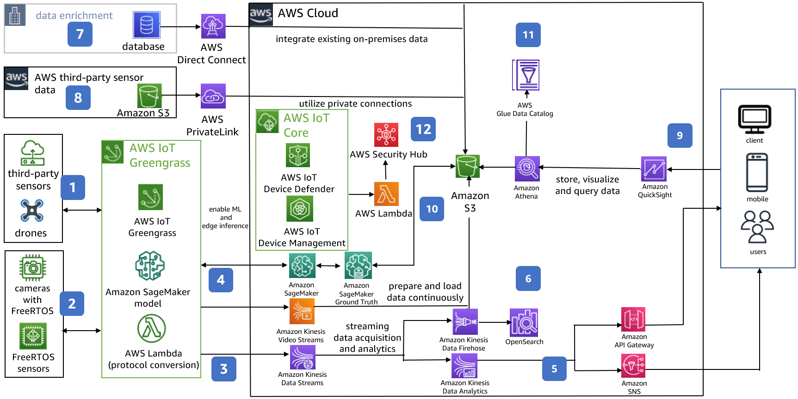
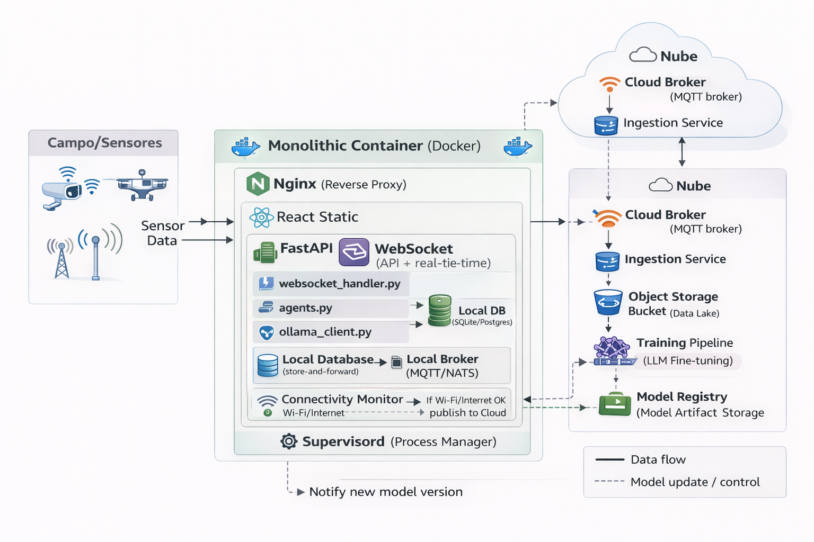
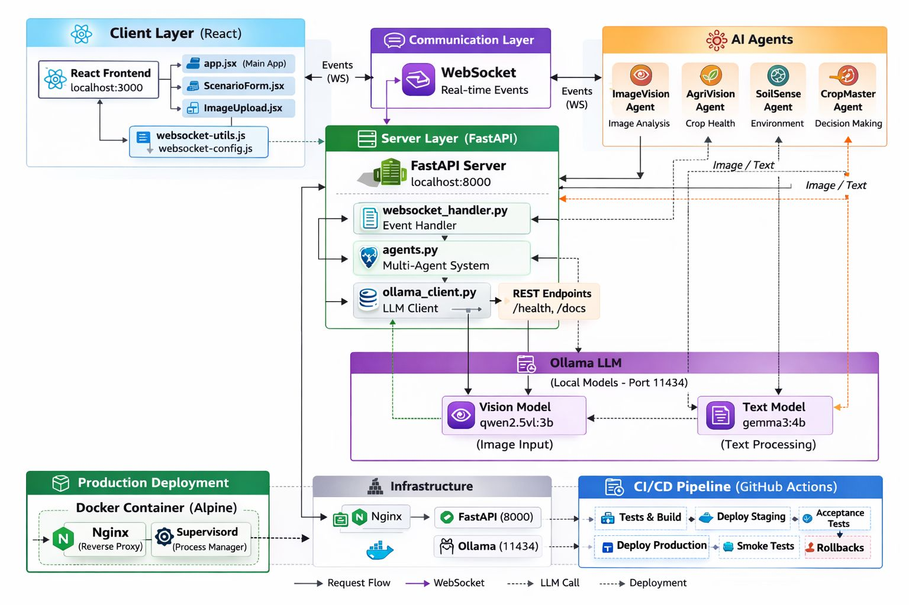
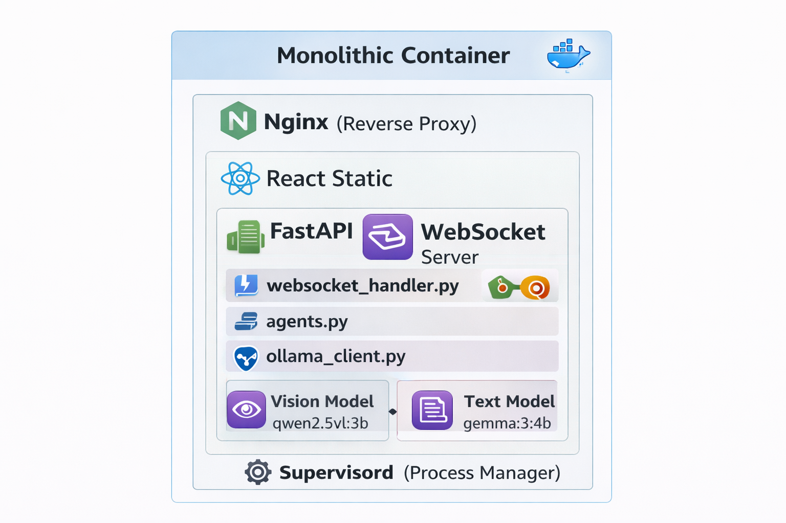

# AgroTechAI: Optimización de Performance en Sistemas Distribuidos de Borde

**Curso:** Sistemas Distribuidos | **Eje:** Performance

**Equipo:** alfa lobo buena maravilla
- Edward Alejandro Rayo Cortes
- Jonathan Sandoval
- Mauricio Andrés Abril Villadiego

**EAFIT 2026-1**

---

## 1. Introducción: El Tópico de Performance

**Definición Técnica**

Performance en sistemas distribuidos es la capacidad de un sistema para ejecutar tareas dentro de restricciones de tiempo, recursos y costo. No es solo "velocidad" - incluye latencia, throughput, utilización y eficiencia energética.

**Dimensiones Clave**

| Dimensión | Definición | Métrica típica |
|-----------|------------|----------------|
| **Latencia** | Tiempo de respuesta end-to-end | p50, p99 |
| **Throughput** | Operaciones por unidad de tiempo | req/s, ops/min |
| **Utilización** | % de recursos efectivamente usados | CPU%, RAM% |
| **Eficiencia** | Output / Recursos consumidos | ops/watt, ops/$ |

**Por qué importa en Fog/Edge**

| Restricción | Cloud | Fog/Edge (servidor puente) |
|-------------|-------|---------------------------|
| RAM disponible | 32-128GB | 4-16GB |
| Conectividad | Estable | Intermitente o nula [6] |
| Costo por nodo | $$$$ | < $200 |

Performance en Fog/Edge significa **hacer más con menos**, manteniendo baja latencia hacia los dispositivos de borde.


---

## 2. Estado del Arte: AgriTech con IA

| Solución | Procesamiento | Conectividad | Costo HW | Costo Op. | Ref |
|----------|---------------|--------------|----------|-----------|-----|
| Microsoft FarmBeats | Cloud (Azure) | Requiere internet | Enterprise | Suscripción | [8] |
| John Deere Operations Center | Edge embebido | Satelital | $15,000+ | Suscripción | [9] |
| AWS IoT Greengrass | Edge + Cloud | Requiere para updates | ~$500+ | Pay-per-use | [10] |
| Climate FieldView (Bayer) | Cloud (SaaS) | Requiere internet | N/A | $1,000+/año | [11] |
| **AgroTechAI (SBC)** | **Fog/Edge local** | **Intermitente/offline** | **$99-150** | **$0 (open source)** | - |

**Limitación común en soluciones existentes**: Dependencia de conectividad estable y/o hardware costoso.

---

## 2.1 Arquitectura de Referencia: AWS IoT para Smart Farm

Esta es una **arquitectura de referencia** para una granja conectada que integra sensores IoT, visión por computadora e inferencia de machine learning en el borde, utilizando servicios de AWS para escalabilidad, análisis y visualización.

<figure style="text-align:center;">
  
  <figcaption>Imagen tomada de <a href="https://docs.aws.amazon.com/architecture-diagrams/latest/smart-farm-on-aws/smart-farm-on-aws.html">https://docs.aws.amazon.com/architecture-diagrams/latest/smart-farm-on-aws/smart-farm-on-aws.html</a></figcaption>
</figure>

**Componentes por Capa**

| Capa | Servicios AWS | Función |
|------|---------------|---------|
| **Edge** | IoT Greengrass, FreeRTOS | Conectividad intermitente, inferencia local |
| **Ingesta** | Kinesis Data/Video Streams | Streaming de datos y video |
| **Procesamiento** | Apache Flink, Lambda, SNS | Análisis real-time, alertas |
| **Almacenamiento** | S3, OpenSearch | Data lake, consultas |
| **ML** | SageMaker, Ground Truth | Entrenamiento, etiquetado |
| **Seguridad** | IoT Device Defender, Security Hub | Monitoreo centralizado |

**Observación**: Esta arquitectura requiere ~12 servicios cloud coordinados. Para edge con recursos limitados, se necesita simplificar.


---

## 3. Brecha: Desafíos para Edge con Recursos Limitados

> **SBC (Single Board Computer)**: Computador completo en una sola placa (ej. Raspberry Pi, Orange Pi). Típicamente 4-16GB RAM, bajo consumo energético, costo $50-150 USD. Ideales como servidores puente en arquitecturas Edge/Fog.

| Desafío | Dato | Impacto en Performance |
|---------|------|----------------------|
| **Conectividad** | 60% zonas rurales con internet intermitente [7] | Soluciones cloud-dependent fallan |
| **Costo** | Hardware enterprise: $1K-$15K+ | Inviable para múltiples nodos edge |
| **Recursos** | Modelos LLM típicos: 8-32GB RAM | Incompatibles con SBCs (4-8GB) |

**Requisitos para Edge Computing con IA**

| Requisito | Objetivo |
|-----------|----------|
| Procesamiento local | Inferencia sin dependencia cloud |
| Hardware económico | < $200 USD por nodo |
| Modelos optimizados | < 4GB RAM total |
| Baja latencia | p99 < 180s para diagnóstico |


---

## 4. Caso de Estudio: AgroTechAI como PoC de Performance

**Relación con el caso de referencia (AWS Smart Farm)**

| Aspecto | AWS Smart Farm (Referencia) | AgroTechAI (PoC) |
|---------|----------------------------|------------------|
| Arquitectura | 12+ servicios cloud | 1 contenedor consolidado |
| Dependencia cloud | Alta | Mínima (modo Fog/Local) |
| Costo | Enterprise ($$$) | SBC ($99-150) |
| **Objetivo** | Escalabilidad cloud | **Validar técnicas de performance en edge** |

AgroTechAI es una Prueba de Concepto (PoC) que toma como referencia arquitecturas enterprise (AWS Smart Farm) y aplica técnicas de optimización de performance para funcionar en hardware de recursos limitados.

| Agente | Modelo | Función | Desafío de Performance |
|--------|--------|---------|----------------------|
| ImageVision | moondream (~1.8B) | Análisis de imagen | Mayor consumo de recursos |
| AgriVision | gemma3:270m | Salud del cultivo | Latencia de inferencia |
| SoilSense | gemma3:270m | Condiciones ambientales | Concurrencia |
| CropMaster | gemma3:270m | Decisión final | Orquestación |

<figure style="text-align:center;">
  
  <figcaption>Arquitectura Fog: servidor puente procesa localmente, sincroniza con nube cuando hay conectividad</figcaption>
</figure>

---

## 5. El Problema de Performance

**Conflicto Fundamental**

| Componente | Requisito típico | Disponible en Fog/Edge |
|------------|------------------|------------------------|
| LLM 4B+ params | 8-16GB RAM | 2-8GB total |
| Inferencia GPU | NVIDIA recomendado | CPU-only común |
| Conectividad | Estable para updates | Intermitente/nula |

**Métricas del Problema**

| Hardware | RAM Total | ¿Soporta LLM 4B+? |
|----------|-----------|-------------------|
| Raspberry Pi 4 | 4-8GB | ❌ Insuficiente |
| Mini PC económico | 8-16GB | ⚠️ Ajustado |
| **Modelos optimizados** | moondream ~2GB, gemma3:270m ~1GB | ✅ Viable |

**Trade-off Identificado**

| Dimensión | Maximizar | Consecuencia |
|-----------|-----------|--------------|
| Calidad del modelo | Más parámetros | Más RAM, mayor latencia |
| Recursos disponibles | Menos RAM | Modelos más pequeños |
| Latencia de respuesta | Más rápido | Menos precisión |

No podemos maximizar las tres simultáneamente. Optimizar recursos también reduce impacto ambiental.


---

## 6. Solución: Arquitectura Consolidada

**Decisiones de Diseño**

| Decisión | Implementación | Beneficio |
|----------|----------------|-----------|
| Consolidación de servicios | Un contenedor (Supervisord) en lugar de 4 aislados | Elimina overhead de red virtual |
| Modelos optimizados | moondream + gemma3:270m (ver Sección 4) | Reduce RAM de ~8GB a ~3GB |

---

## 6.1 Modos de Deployment: Fog vs Local

**Modo Fog (Default)** - Servidor puente sincroniza con la nube

```
┌──────────────┐      ┌────────────────┐      ┌──────────────┐
│    BORDE     │      │    PUENTE      │      │    NUBE      │
│              │      │                │      │              │
│  - Sensores  │ ───► │  - Ollama      │ ◄──► │  - Sync      │
│  - Celular   │      │  - FastAPI     │      │  - Updates   │
│  - Cámara    │      │  - Nginx       │      │  - CI/CD     │
│              │      │  (mini PC)     │      │  - Backups   │
└──────────────┘      └────────────────┘      └──────────────┘
     WiFi local            4GB RAM              Conectividad
                                                intermitente
```

**Modo Local** - Cliente/Servidor sin nube (cuando no hay conectividad)

```
┌──────────────┐      ┌────────────────┐
│    BORDE     │      │    PUENTE      │       ✗ Sin nube
│              │      │                │
│  - Sensores  │ ───► │  - Ollama      │       ⚠ Trade-offs:
│  - Celular   │      │  - FastAPI     │       - Updates manuales
│  - Cámara    │      │  - Nginx       │       - Backups locales
│              │      │  (mini PC)     │       - Soporte presencial
└──────────────┘      └────────────────┘
     WiFi local            4GB RAM
```

**Flexibilidad arquitectónica**: El mismo sistema soporta ambos modos según las condiciones de conectividad y recursos disponibles.


---


## 6.2 AgroTechAI: Arquitectura enfocada al rendimiento

| Multi-contenedor (aislado) | Consolidado (producción) |
|---------|----------------------|
|  |  |

---

## 7. Implementación Técnica: Supervisord

**Por qué Supervisord como PID 1**

| Beneficio | Descripción |
|-----------|-------------|
| Gestión unificada | Ciclo de vida de procesos co-ubicados |
| Punto de control único | Nginx, FastAPI, Ollama, Model-Puller |

**Orden de Inicio (Priority) - Configuración Real**

| Programa | Comando | Priority | AutoRestart | Reintentos |
|----------|---------|----------|-------------|------------|
| Ollama | `/usr/bin/ollama serve` | 50 | Sí | 5 |
| Model-Puller | `/usr/local/bin/pull-models.sh` | 200 | No | 3 |
| FastAPI | `python3 main.py` | 300 | Sí | 5 |
| Nginx | `nginx -g "daemon off;"` | - | Sí | 5 |

**Beneficio de Performance**

| Aspecto | Docker bridge | Consolidado (localhost) | Mejora |
|---------|---------------|------------------------|--------|
| Latencia inter-servicio | ~1-2ms | ~0.1ms | 20x |
| Comunicación | Red virtual | `127.0.0.1:5000` | Directa |
| Logs | Distribuidos | `/var/log/supervisor/` (10MB rotación) | Centralizados |


---

## 8. Implementación Técnica: Health Checks

**Problema: Fallos Parciales [2]**

En contenedor consolidado, si un proceso falla, el contenedor sigue "vivo" pero disfuncional. Kubernetes/Docker no detectan el fallo parcial. Como señala Kleppmann, en sistemas distribuidos los fallos parciales son más peligrosos que los totales.

**Solución: Health Check Compuesto (Implementación Real)**

```python
@app.get("/health")
async def health_check():
    ollama_status = check_ollama_connection()  # Timeout: 5s
    status = "healthy" if ollama_status else "error"
    return {"status": status, "ollama": ollama_status, "model": MODEL_NAME}

def check_ollama_connection() -> bool:
    response = requests.get(f"{OLLAMA_URL}/api/tags", timeout=5)
    return response.status_code == 200
```

**Health Checks según Entorno de Deployment**

| Entorno | Mecanismo | Configuración |
|---------|-----------|---------------|
| **Servidor puente (Docker Compose)** | Docker healthcheck | `test: curl -f http://localhost:8000/health` |
| **Servidor puente (systemd)** | systemd watchdog | `WatchdogSec=30`, `Restart=on-failure` |
| **Modo Fog con nube (K8s)** | Probes (startup, liveness, readiness) | Ver tabla abajo |

**Probes en Kubernetes (solo aplica en modo Fog con infraestructura cloud)**

| Probe | Initial Delay | Period | Timeout | Retries | Propósito |
|-------|---------------|--------|---------|---------|-----------|
| Startup | 30s | 10s | 5s | 12 | Espera carga modelo (~2 min) |
| Readiness | 45s | 10s | 5s | 3 | Controla tráfico |
| Liveness | 60s | 30s | 10s | 3 | Reinicia si falla |

> **Nota**: K8s requiere un control plane (2-4GB RAM adicionales). Para el servidor puente standalone, Docker Compose o systemd son más apropiados.

**Impacto en MTTR (Mean Time To Recovery)**

| Fase | Tiempo | Acumulado |
|------|--------|-----------|
| Detección de fallo | máx 30s | 30s |
| Reinicio contenedor | ~5-10s | 40s |
| Carga modelo | ~60-90s | ~2 min |
| **MTTR total** | | **< 2 minutos** |


---

## 9. Resultados: Configuración de Producción

**Recursos del Servidor Puente (Valores Reales)**

| Aspecto | Valor | Notas |
|---------|-------|-------|
| **RAM Total** | **4GB** (reserva: 1GB) | Suficiente para mini PC económico |
| **CPU Total** | **2.0 cores** | CPU-only, sin GPU |
| Modelo Visión | moondream (~1.8B) | Para ImageVision |
| Modelo Texto | gemma3:270m (~270M) | Para AgriVision, SoilSense, CropMaster |
| Contenedores | 1 consolidado | Supervisord como PID 1 |
| Latencia objetivo | < 180s | CTQ para diagnóstico completo |

**Configuración de Pool de Conexiones (Ollama Client)**

```python
# Configuración real para manejo eficiente de requests
pool_connections = 20    # Conexiones en pool
pool_maxsize = 50        # Máximo pool
max_retries = 3          # Reintentos con backoff
timeout = 60             # Timeout por request (segundos)
```

**Implicación**

La consolidación y selección de modelos optimizados permiten deployment en hardware de servidor puente real con solo **4GB RAM** y **2 CPU cores**, que actúa como gateway entre los dispositivos de borde (sensores, celulares) y procesa la inferencia de IA localmente.

---

## 9.1 Hardware Recomendado para Servidor Puente

**Opciones de SBC (Single Board Computer) para Inferencia LLM**

| SBC | RAM | NPU/Acelerador | Precio | Modelos soportados |
|-----|-----|----------------|--------|-------------------|
| **Orange Pi 5 Pro** | 16GB LPDDR5 | RK3588S NPU | ~$100-150 | 7B/13B (Mistral, Llama 3) |
| **Luckfox Core3576** | Variable | RK3576 NPU (rknn-llm) | ~$99 | Modelos cuantizados |
| **Radxa ROCK Pi N10** | 4-8GB | NPU 3 TOPS | ~$99 | Modelos pequeños |
| **Raspberry Pi 5 + AI HAT+** | 8GB LPDDR4X | Hailo 10H (26 TOPS) | ~$130 | Modelos cuantizados |

**Selección según Caso de Uso**

| Escenario | Hardware sugerido | Justificación |
|-----------|-------------------|---------------|
| Máxima capacidad de modelo | Orange Pi 5 Pro 16GB | 16GB permite cargar modelos 7B-13B completos |
| Máxima eficiencia energética | Luckfox Core3576 | NPU especializado, CPU libre |
| Facilidad de setup | Raspberry Pi 5 + AI HAT+ | Comunidad amplia, documentación extensa |
| Balance costo/rendimiento | Radxa ROCK Pi N10 | NPU dedicado a precio accesible |

---

## 10. Resultados: Métricas de Rendimiento

**Parámetros de Ollama Optimizados**

```yaml
OLLAMA_NUM_PARALLEL=6      # Requests paralelos
OMP_NUM_THREADS=6          # Threads OpenMP
OLLAMA_FLASH_ATTENTION=1   # Atención optimizada
OLLAMA_MAX_LOADED_MODELS=2 # Modelos en memoria
```

**Variables Predictoras de Performance [1]**

| Variable | Impacto | Observación |
|----------|---------|-------------|
| Tiempo de CPU | 70% de varianza en latencia | Predictor principal |
| Lecturas de disco | Secundario | I/O bound en modelos grandes |
| RAM asignada | Negativo si >3.24% over-provisioning | Más no siempre es mejor |

**CTQ (Critical To Quality)**: Latencia p99 < 180s para diagnóstico de imagen en campo.

---

## 10.1 Resultados: Orquestación y Métricas Operativas

**Orquestación según Entorno**

| Entorno | Orquestador | RAM Overhead | Escalamiento |
|---------|-------------|--------------|--------------|
| **Servidor puente** | Docker Compose | ~50-100MB | Manual |
| **Servidor puente** | systemd-nspawn | ~0 | Manual |
| **Modo Fog con nube** | K8s/K3s | 512MB-4GB | HPA automático |

**Servidor Puente: Docker Compose**

```yaml
services:
  agrotech:
    image: agrotech-consolidated:latest
    restart: unless-stopped
    healthcheck:
      test: ["CMD", "curl", "-f", "http://localhost:8000/health"]
      interval: 30s
      timeout: 10s
      retries: 3
    deploy:
      resources:
        limits:
          memory: 4G
          cpus: '2.0'
```

**Modo Fog con Nube: HPA en Kubernetes**

> Esta configuración aplica cuando existe infraestructura cloud. El control plane de K8s consume 2-4GB RAM adicionales, por lo que no es viable en el servidor puente standalone.

```yaml
minReplicas: 1
maxReplicas: 5
metrics:
  - cpu: targetUtilization 70%
  - memory: targetUtilization 80%
```

**Parámetros de Generación LLM Optimizados**

| Parámetro | Valor | Propósito |
|-----------|-------|-----------|
| temperature | 0.7 | Balance creatividad/precisión |
| top_p | 0.9 | Diversidad controlada |
| num_predict | 300 | Máx tokens respuesta |
| timeout | 60s | Límite por request |

**Resultados del Benchmark (5 requests cada escenario)**

| Métrica | Con Imagen | Solo Sensores | Diferencia |
|---------|------------|---------------|------------|
| p50 | 19s | 9s | 2.1x |
| p99 | **49s** | **9s** | **5.3x** |
| Throughput | 2.4/min | 6.8/min | 2.8x |
| RAM pico | ~3GB | ~2GB | 1.5x |
| Tasa éxito | 100% | 100% | = |

**Uso recomendado**: Con imagen para diagnóstico visual completo; solo sensores para monitoreo continuo y alertas rápidas.

---

**Validación del CTQ**

| Métrica | Objetivo | Con Imagen | Solo Sensores | Estado |
|---------|----------|------------|---------------|--------|
| Latencia diagnóstico | < 180s | p99 = 49s | p99 = 9s | **CUMPLE** |
| Disponibilidad | > 99% | 100% (5/5) | 100% (5/5) | **CUMPLE** |
| Memoria pico | < 4GB | ~3GB | ~2GB | **CUMPLE** |
| MTTR | < 5 min | Estimado ~2 min | Estimado ~2 min | Diseñado |

---

## 11. Sustentación: Por qué responde a Performance

**Tesis Central**

Performance no es solo hacer cosas rápido, es hacer cosas eficientemente dentro de restricciones. AgroTechAI demuestra optimización de performance bajo restricciones severas de recursos, priorizando **MTTR sobre MTBF** [12].

**Técnicas Aplicadas y su Conexión Teórica**

| Técnica | Impacto | Referencia |
|---------|---------|------------|
| Consolidación de servicios | Elimina overhead virtualización (1-2.4%) | Lloyd et al. [1] |
| Modelos optimizados para Fog | moondream + gemma3:270m → ~3GB RAM, p99 ~49s | - |
| Comunicación localhost | Reduce latencia inter-servicio 20x | Aldossary [5] |
| Health checks compuestos | Detecta fallos parciales | Kleppmann [2] |
| Priorización MTTR | Recuperación < 2 min vs. infalibilidad | [12] |

**Conexión con Teoría de Sistemas Distribuidos**

| Concepto | Aplicación en AgroTechAI | Ref |
|----------|-------------------------|-----|
| Fallos Parciales | Health checks compuestos detectan fallas internas | [2] |
| Estabilidad como Filtro | Servidor puente con alta permanencia, sin migración | [5] |
| El "Depende" | Consolidación para Fog/Edge, aislamiento para Cloud | [3] |
| Renovabilidad de Métricas | CTQ basado en comportamiento, no MTBF histórico | [12] |


---

## 12. Ventajas de la Arquitectura

| Categoría | Ventaja | Detalle |
|-----------|---------|---------|
| **Operacional** | Deployment simplificado | Una imagen, un contenedor |
| **Operacional** | Menor superficie de ataque | Menos puntos de entrada |
| **Operacional** | Recuperación automática | Supervisord + health checks |
| **Performance** | Latencia predecible | Sin variabilidad de red virtual |
| **Performance** | Utilización eficiente | Recursos compartidos sin overhead |
| **Performance** | Escalamiento vertical | Aumentar límites del contenedor |
| **Costo** | Hardware económico | SBC de ~$99-150 USD |
| **Costo** | Menor consumo energético | Menos procesos de orquestación |
| **Costo** | Sin licencias | Stack completamente open source |


---

## 13. Riesgos y Limitaciones

**Riesgo 1: Punto Único de Fallo**

Consolidación = si el contenedor cae, todo cae. Mitigación: health checks agresivos + restart policies (Docker Compose o systemd). En modo Fog con nube, réplicas adicionales pueden absorber fallos.

**Riesgo 2: Escalamiento Horizontal Limitado**

No puedes escalar solo el LLM o solo la API. Mitigación: en modo Fog, la nube puede absorber picos de demanda.

**Riesgo 3: Calidad del Modelo**

Modelos pequeños (moondream, gemma3:270m) son menos capaces que modelos grandes. Mitigación: prompts optimizados + validación humana para casos críticos.

**Riesgo 4: Costos Operativos en Modo Local**

Cuando se despliega **sin conexión a la nube** (modo cliente/servidor local), se transfieren responsabilidades al operador:
- Actualización manual de modelos (sin CI/CD automatizado)
- Mantenimiento físico del servidor puente
- Gestión de backups y recuperación ante desastres
- Soporte técnico debe ser presencial

> En **modo Fog**, estos costos se mitigan mediante sincronización y gestión remota.

Mitigación modo local: Capacitación a cooperativas + documentación + scripts simplificados.

**Limitación Honesta**

Esta arquitectura optimiza para recursos limitados, no para throughput máximo. No es la solución para 10,000 requests/segundo.


---

## 14. Trade-offs Explícitos

**Trade-off 1: Recursos (Consolidación vs Aislamiento)**

| Lo que Ganamos | Lo que Perdemos |
|----------------|-----------------|
| Funcionamiento en 4GB RAM | Flexibilidad de escalar componentes independientes |
| Latencia inter-servicio ~0.1ms | Capacidad de modelos más grandes |
| Deployment de una sola imagen | Facilidad de debugging (procesos co-ubicados) |
| Solo 2 CPU cores requeridos | Aislamiento entre servicios |

**Trade-off 2: Modo Fog vs Modo Local**

| Aspecto | Modo Fog (Default) | Modo Local |
|---------|-------------------|------------|
| Conectividad | Requiere intermitente | No requiere |
| Actualización modelos | Automática (CI/CD) | Manual |
| Backups | Sincronizados a nube | Responsabilidad local |
| Soporte técnico | Remoto posible | Presencial requerido |
| Costos cloud | Suscripción/uso | $0 |
| Datos | Pueden sincronizarse | Nunca salen de la finca |

**¿Quién asume el costo operativo?**

| Modo | Responsable |
|------|-------------|
| **Fog** | Compartido: nube absorbe sincronización, CI/CD, backups |
| **Local** | Operador local: cooperativa, técnico agrícola, agricultor |

**Trade-off 3: Runtime de Inferencia (Simplicidad vs Eficiencia)**

| Runtime | Requisito | Ventaja | Desventaja |
|---------|-----------|---------|------------|
| **Ollama** (actual) | CPU/GPU NVIDIA | Fácil setup, API simple | Lento en CPU-only |
| **vLLM** | GPU NVIDIA | Máximo throughput, batching óptimo | Hardware costoso |
| **Vulkan backend** [14] | Cualquier GPU | CPU + apoyo de GPU integrada | Configuración más compleja |
| **rkllama** [13] | NPU (ej. Orange Pi 5) | Libera CPU, eficiente en recursos | Hardware específico |

**¿Por qué elegimos Ollama?**

| Razón | Detalle |
|-------|---------|
| Simplicidad | Una línea instala todo |
| Compatibilidad | Funciona en CPU-only sin configuración adicional |
| Comunidad | Modelos pre-optimizados (moondream, gemma3) |

**Optimización futura**: Migrar a rkllama [13] (NPU) o Vulkan [14] (GPU integrada) podría mejorar eficiencia 2-3x.

**Trade-off 4: Orquestación (Automatización vs Recursos)**

| Orquestador | RAM Overhead | Escalamiento | Caso de uso |
|-------------|--------------|--------------|-------------|
| **systemd-nspawn** | ~0 | Manual | Servidor puente con recursos mínimos |
| **Docker Compose** | ~50-100MB | Manual | Servidor puente, fácil configuración |
| **K3s** | ~512MB-1GB | Semi-automático | Edge con múltiples nodos |
| **Kubernetes** | 2-4GB | HPA automático | Modo Fog con infraestructura cloud |

**¿Por qué no Kubernetes en el servidor puente?**

En un Orange Pi de 4GB, el control plane de K8s consumiría 50-100% de la RAM disponible, dejando insuficiente para la aplicación. Para un servidor puente standalone, Docker Compose o systemd proporcionan restart policies y health checks con overhead mínimo.

**Trade-off 5: Lenguaje (Velocidad de Desarrollo vs Eficiencia en Runtime)**

| Lenguaje | RAM Runtime | Startup | Binario | Caso de uso |
|----------|-------------|---------|---------|-------------|
| **Python** (actual) | ~50-100MB | ~500ms-1s | Requiere intérprete | PoC, desarrollo rápido |
| **Go** | ~5-10MB | ~10-50ms | Self-contained | APIs, microservicios |
| **Rust** | ~2-5MB | ~5-20ms | Self-contained | Máximo rendimiento |
| **Zig/Nim** | ~1-5MB | ~5-20ms | Self-contained | Ultra ligero, emergente |

**¿Por qué Python actualmente?**

| Razón | Detalle |
|-------|---------|
| Ecosistema ML | FastAPI, requests, Pillow |
| Velocidad de desarrollo | Validar concepto rápidamente |
| Integración | API directa con Ollama |

**Optimización futura**: Reescribir en Go/Rust reduciría memoria ~10x y startup ~20x.

**Trade-off 6: LLM vs Modelo ML Específico (Flexibilidad vs Eficiencia)**

| Enfoque | RAM | Latencia | Datos requeridos | Flexibilidad |
|---------|-----|----------|------------------|--------------|
| **LLM genérico** (actual) | ~2-3GB | ~10-50s | Ninguno (zero-shot) | Alta (cualquier prompt) |
| **ML específico** (futuro) | ~50-200MB | ~10-100ms | Miles de muestras etiquetadas | Baja (tarea específica) |

**¿Por qué LLM actualmente?**

| Razón | Detalle |
|-------|---------|
| Sin datos etiquetados | No hay dataset de enfermedades de cultivos colombianos |
| Flexibilidad | Puede responder preguntas no anticipadas |
| Prototipado rápido | Valida el concepto sin entrenar modelos |

**Estrategia de transición**:

| Fase | Enfoque | Objetivo |
|------|---------|----------|
| 1. Actual | LLM (moondream + gemma3) | Validar concepto, recolectar datos |
| 2. Híbrido | ML para clasificación + LLM para explicación | Reducir latencia en tareas comunes |
| 3. Futuro | ML específico (CNN/ViT) | Máxima eficiencia con datos suficientes |

> **Insight**: El LLM es el bootstrap. Con suficientes datos recolectados en producción, un modelo ML específico podría reducir latencia de ~10s a ~100ms (100x) y RAM de ~3GB a ~200MB (15x).

---

## 15. Conclusiones

**Hallazgo Principal**

La consolidación de servicios con modelos optimizados (moondream + gemma3:270m) permite ejecutar sistemas de IA en servidores puente con **4GB RAM** y **2 CPU cores**, cumpliendo el CTQ de latencia **p99 < 180s**.

| Métrica | Objetivo | Con Imagen | Solo Sensores | Estado |
|---------|----------|------------|---------------|--------|
| Latencia p99 | < 180s | 49s | 9s (5.3x) | **CUMPLE** |
| Tasa de éxito | > 99% | 100% | 100% | **CUMPLE** |
| RAM | < 4GB | ~3GB | ~2GB | **CUMPLE** |
| Throughput | - | 2.4/min | 6.8/min | - |

**Lecciones de Performance**

1. **Modelo pequeño + hardware disponible > modelo grande + hardware inexistente**
2. **Latencia de red virtual es costo oculto**: Docker bridge añade ~2ms vs ~0.1ms localhost
3. **Health checks compuestos son críticos**: Detectan fallos parciales que el orquestador no ve
4. **MTTR sobre MTBF** [12]: En entornos rurales, priorizar recuperación rápida sobre infalibilidad
5. **Selección de modelos importa**: moondream + gemma3:270m logran balance calidad/velocidad
6. **Dos modos de operación**: Análisis con imagen para diagnóstico visual, solo sensores para monitoreo continuo (5.3x más rápido)

**El Axioma del "Depende"**

La arquitectura óptima depende del contexto [3]:

| Contexto | Arquitectura recomendada |
|----------|-------------------------|
| Recursos limitados | Consolidación en servidor puente |
| Conectividad disponible | Modo Fog (sincronización con nube) |
| Sin conectividad | Modo Local (trade-offs operativos) |
| Capacidad técnica local | Factor decisivo para modo Local |

**Aplicabilidad**

Patrón replicable para aplicaciones de ML en arquitectura Fog:

| Dominio | Ejemplo |
|---------|---------|
| IoT industrial | Gateway local + sincronización cloud |
| Visión por computador | Procesamiento en campo + backup a nube |
| NLP embebido | Inferencia local + actualizaciones remotas |
| Sistemas offline-first | Operar sin conexión, sincronizar cuando exista |


---

## 16. Bibliografía (Formato IEEE)

[1] W. Lloyd, S. Pallickara, O. David, J. Lyon, M. Arabi, and K. Rojas, "Performance implications of multi-tier application deployments on Infrastructure-as-a-Service clouds," *Future Generation Computer Systems*, vol. 29, no. 5, pp. 1254-1264, 2013.

[2] M. Kleppmann, *Designing Data-Intensive Applications*. O'Reilly Media, 2017.

[3] K. Kingsbury (Aphyr), "Distributed Systems Class," 2021. [Online]. Available: https://github.com/aphyr/distsys-class

[4] AgroTechAI Team, "AgroTechAI: AI-driven crop care suggestions," 2024. [Online]. Available: https://github.com/AgroTechCoAI/AgroTechAI

[5] M. Aldossary, "A Review of Dynamic Resource Management in Cloud Computing," *SN Computer Science*, vol. 2, no. 4, 2021.

[6] A. Luntovskyy, M. Klymash, *Fog Computing and Cloud Computing*, 2019.

[7] MinTIC Colombia, "Informe de Conectividad Rural," 2023. [Online]. Available: https://mintic.gov.co/

[8] Microsoft Research, "FarmBeats: An IoT Platform for Data-Driven Agriculture" 2019. [Online]. Available: https://www.microsoft.com/en-us/research/wp-content/uploads/2017/03/FarmBeats-webpage-1.pdf

[9] John Deere, "Operations Center: Precision Agriculture," 2024. [Online]. Available: https://www.deere.com/

[10] Amazon Web Services, "Smart Farm on AWS: Architecture for Agricultural IoT," 2024. [Online]. Available: https://docs.aws.amazon.com/architecture-diagrams/latest/smart-farm-on-aws/smart-farm-on-aws.html

[11] Bayer Crop Science, "Climate FieldView: Digital Farming Platform," 2024. [Online]. Available: https://www.bayer.com/en/agriculture/digital-farming

[12] E. A. Rayo Cortés, "Análisis de Disponibilidad y Resiliencia en Sistemas de Monitoreo Agrícola," EAFIT, 2026. Análisis interno del proyecto AgroTechAI sobre MTBF, MTTR y renovabilidad de métricas en contexto rural colombiano.

[13] NotPunchnox, "rkllama: Run LLMs on Rockchip NPU," 2024. [Online]. Available: https://github.com/NotPunchnox/rkllama. Runtime optimizado para NPU en Orange Pi 5 y dispositivos con Rockchip RK3588, más eficiente en recursos que Ollama para edge computing.

[14] Khronos Group, "Vulkan - Cross-platform GPU API," 2024. [Online]. Available: https://www.vulkan.org/. API de gráficos de bajo nivel que permite acceso uniforme a GPUs de diferentes fabricantes, utilizable como backend para inferencia de ML en hardware heterogéneo.

---
