# 5 mins of Kubernetes - AgroTech AI Demo

This demo showcases production-ready Kubernetes patterns using your AgroTech AI application!
It is for educational purposes as part of EAFIT University coursework.

## Table of Contents
1. [Introduction to Kubernetes](#introduction-to-kubernetes)
2. [Key Kubernetes Concepts](#key-kubernetes-concepts)
3. [Demo Setup Prerequisites](#demo-setup-prerequisites)
4. [Quick Start Demo](#quick-start-demo)
5. [Detailed Walkthrough](#detailed-walkthrough)
6. [Live Demonstrations](#live-demonstrations)
7. [Troubleshooting](#troubleshooting)
8. [Cleanup](#cleanup)

---

## Introduction to Kubernetes

### What is Kubernetes?
Kubernetes (K8s) is an open-source container orchestration platform that automates the deployment, scaling, and management of containerized applications.

### Why Kubernetes?
- **Container Orchestration**: Manages containers across multiple hosts
- **Self-Healing**: Automatically restarts failed containers
- **Horizontal Scaling**: Scale applications up/down based on demand
- **Load Balancing**: Distributes traffic across container instances
- **Rolling Updates**: Deploy new versions with zero downtime
- **Service Discovery**: Automatic DNS-based service discovery
- **Storage Orchestration**: Automatically mount storage systems

### Docker vs Kubernetes: When to Use What?

| Scenario | Docker | Kubernetes |
|----------|--------|------------|
| **Local Development** | ✅ Perfect - Simple, fast, easy to use | ❌ Overkill - Too complex for single developer |
| **Small Applications (1-5 containers)** | ✅ Ideal - Docker Compose is sufficient | ⚠️ Unnecessary complexity |
| **CI/CD Pipeline** | ✅ Great for build & test | ✅ Great for deployment & orchestration |
| **Production (Single Server)** | ✅ Good - Simple deployment | ⚠️ Can work but adds overhead |
| **Production (Multi-Server/Cloud)** | ❌ Manual coordination required | ✅ Designed for this - Auto-scaling, load balancing |
| **High Availability Required** | ❌ Requires custom setup | ✅ Built-in - Self-healing, replicas |
| **Auto-Scaling** | ❌ Manual or third-party tools | ✅ Native HPA (HorizontalPodAutoscaler) |
| **Zero-Downtime Deployments** | ⚠️ Possible but manual | ✅ Built-in rolling updates |
| **Microservices (10+ services)** | ⚠️ Complex Docker Compose files | ✅ Designed for microservices |
| **Learning Curve** | ✅ Easy to start | ❌ Steep learning curve |
| **Resource Overhead** | ✅ Minimal overhead | ⚠️ Requires more resources (control plane) |
| **Monitoring & Logging** | ⚠️ Third-party tools needed | ✅ Rich ecosystem (Prometheus, ELK) |

**Key Takeaway**:
- **Use Docker** for development, testing, and small-scale production
- **Use Kubernetes** for large-scale production, microservices, and when you need advanced orchestration features

### Kubernetes Architecture

Kubernetes follows a **control plane and worker node architecture** with two main component types:

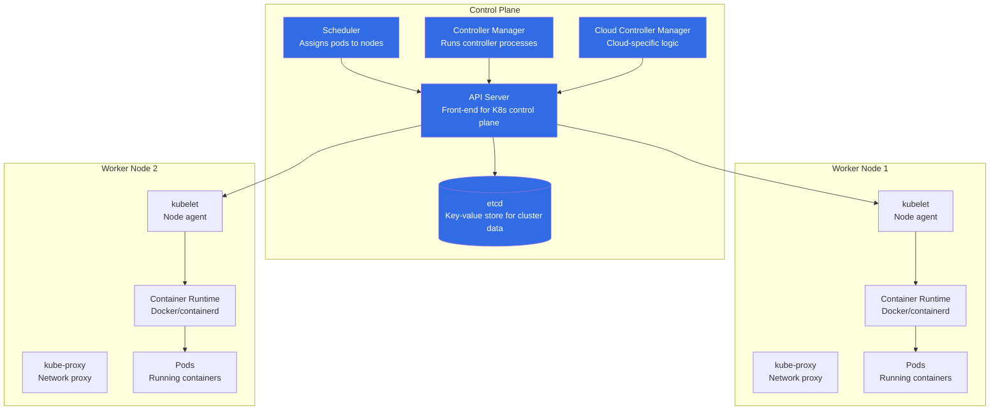
```mermaid
graph TB
    subgraph "Control Plane"
        API[API Server<br/>Front-end for K8s control plane]
        ETCD[(etcd<br/>Key-value store for cluster data)]
        SCHED[Scheduler<br/>Assigns pods to nodes]
        CM[Controller Manager<br/>Runs controller processes]
        CCM[Cloud Controller Manager<br/>Cloud-specific logic]
    end

    subgraph "Worker Node 1"
        KUBELET1[kubelet<br/>Node agent]
        PROXY1[kube-proxy<br/>Network proxy]
        RUNTIME1[Container Runtime<br/>Docker/containerd]
        POD1[Pods<br/>Running containers]
    end

    subgraph "Worker Node 2"
        KUBELET2[kubelet<br/>Node agent]
        PROXY2[kube-proxy<br/>Network proxy]
        RUNTIME2[Container Runtime<br/>Docker/containerd]
        POD2[Pods<br/>Running containers]
    end

    API --> KUBELET1
    API --> KUBELET2
    API --> ETCD
    SCHED --> API
    CM --> API
    CCM --> API
    KUBELET1 --> RUNTIME1
    KUBELET2 --> RUNTIME2
    RUNTIME1 --> POD1
    RUNTIME2 --> POD2

    style API fill:#326ce5,color:#fff
    style ETCD fill:#326ce5,color:#fff
    style SCHED fill:#326ce5,color:#fff
    style CM fill:#326ce5,color:#fff
    style CCM fill:#326ce5,color:#fff
```

#### Control Plane Components

The Control Plane makes global decisions about the cluster and detects/responds to cluster events.

| Component | Description | Responsibility |
|-----------|-------------|----------------|
| **API Server** | Front-end for the Kubernetes control plane | • Exposes Kubernetes API<br/>• Validates and processes REST requests<br/>• Updates etcd<br/>• Gateway for all cluster operations |
| **etcd** | Distributed key-value store | • Stores all cluster data<br/>• Configuration data<br/>• State of the cluster<br/>• Backup and restore point |
| **Scheduler** | Watches for newly created pods | • Assigns pods to nodes<br/>• Considers resource requirements<br/>• Hardware/software constraints<br/>• Affinity/anti-affinity rules |
| **Controller Manager** | Runs controller processes | • Node Controller (monitors node health)<br/>• Replication Controller (maintains pod count)<br/>• Endpoints Controller (joins Services & Pods)<br/>• Service Account Controller (creates default accounts) |
| **Cloud Controller Manager** | Links to cloud provider APIs | • Node management<br/>• Route management<br/>• Load balancer management<br/>• Volume management |

#### Worker Node Components

Worker nodes run the actual application workloads (containers).

| Component | Description | Responsibility |
|-----------|-------------|----------------|
| **kubelet** | Primary node agent | • Registers node with API server<br/>• Ensures containers in pods are running<br/>• Reports node/pod status<br/>• Executes container health checks |
| **kube-proxy** | Network proxy | • Maintains network rules<br/>• Enables pod-to-pod communication<br/>• Load balances traffic to Services<br/>• Implements Service abstraction |
| **Container Runtime** | Software for running containers | • Pulls container images<br/>• Runs containers<br/>• Supports Docker, containerd, CRI-O |
| **Pods** | Smallest deployable units | • Run application containers<br/>• Share network/storage<br/>• Co-located and co-scheduled |

#### How It All Works Together

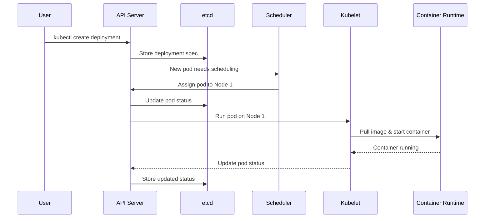
```mermaid
sequenceDiagram
    participant User
    participant API as API Server
    participant ETCD as etcd
    participant Scheduler
    participant Kubelet
    participant Container as Container Runtime

    User->>API: kubectl create deployment
    API->>ETCD: Store deployment spec
    API->>Scheduler: New pod needs scheduling
    Scheduler->>API: Assign pod to Node 1
    API->>ETCD: Update pod status
    API->>Kubelet: Run pod on Node 1
    Kubelet->>Container: Pull image & start container
    Container-->>Kubelet: Container running
    Kubelet-->>API: Update pod status
    API->>ETCD: Store updated status
```

**Key Flow**:
1. **User** sends commands via `kubectl` to **API Server**
2. **API Server** validates request and stores in **etcd**
3. **Scheduler** watches for unscheduled pods and assigns them to nodes
4. **kubelet** on the assigned node pulls images and starts containers
5. **Controllers** continuously monitor and maintain desired state
6. **kube-proxy** manages networking for pod-to-pod and external communication

#### Kubernetes in Production

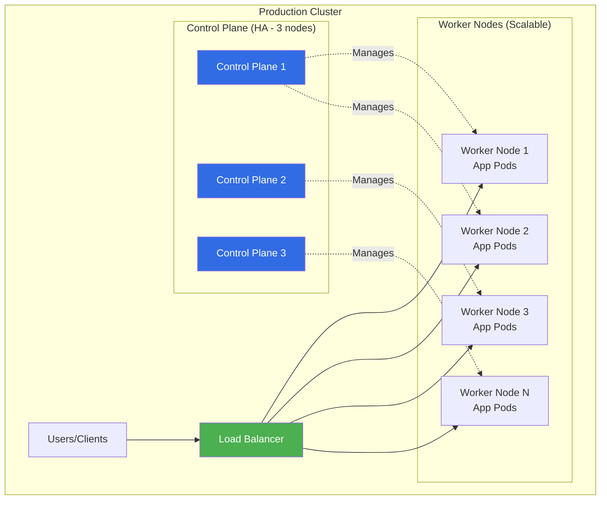
```mermaid
graph TB
    subgraph "Production Cluster"
        subgraph "Control Plane (HA - 3 nodes)"
            CP1[Control Plane 1]
            CP2[Control Plane 2]
            CP3[Control Plane 3]
        end

        subgraph "Worker Nodes (Scalable)"
            W1[Worker Node 1<br/>App Pods]
            W2[Worker Node 2<br/>App Pods]
            W3[Worker Node 3<br/>App Pods]
            W4[Worker Node N<br/>App Pods]
        end

        LB[Load Balancer]
        USERS[Users/Clients]
    end

    USERS --> LB
    LB --> W1
    LB --> W2
    LB --> W3
    LB --> W4

    CP1 -.->|Manages| W1
    CP1 -.->|Manages| W2
    CP2 -.->|Manages| W3
    CP3 -.->|Manages| W4

    style CP1 fill:#326ce5,color:#fff
    style CP2 fill:#326ce5,color:#fff
    style CP3 fill:#326ce5,color:#fff
    style LB fill:#4caf50,color:#fff
```

**Production Best Practices**:
- **High Availability**: Multiple control plane nodes (typically 3 or 5)
- **Scalability**: Add/remove worker nodes based on demand
- **Load Balancing**: Distribute traffic across worker nodes
- **Monitoring**: Track cluster health and performance
- **Backup**: Regular etcd backups for disaster recovery

#### Kubernetes in the Cloud: Managed Services

All major cloud providers offer managed Kubernetes services and use Kubernetes internally:

| Cloud Provider | Managed K8s Service | Internal Usage | Key Features |
|----------------|---------------------|----------------|--------------|
| **Amazon Web Services (AWS)** | Amazon EKS (Elastic Kubernetes Service) | • Amazon uses K8s for internal microservices<br/>• Powers AWS container services | • Fully managed control plane<br/>• Integrates with AWS services (IAM, VPC, ELB)<br/>• Auto-scaling with Karpenter |
| **Google Cloud Platform (GCP)** | Google Kubernetes Engine (GKE) | • Google invented Kubernetes (based on Borg)<br/>• Runs most Google services on containers | • Autopilot mode (fully managed)<br/>• Best K8s integration (native)<br/>• Advanced networking with Anthos |
| **Microsoft Azure** | Azure Kubernetes Service (AKS) | • Microsoft uses K8s for Azure services<br/>• GitHub runs on Kubernetes | • Free control plane<br/>• Azure AD integration<br/>• Virtual nodes (serverless) |
| **IBM Cloud** | IBM Cloud Kubernetes Service | • Red Hat OpenShift (IBM-owned) built on K8s<br/>• Watson AI services on K8s | • OpenShift integration<br/>• Enterprise security<br/>• Multicloud support |
| **Oracle Cloud** | Oracle Container Engine for Kubernetes (OKE) | • Oracle Cloud services on K8s | • Always free tier<br/>• Oracle DB integration |
| **Alibaba Cloud** | Alibaba Cloud Container Service for Kubernetes (ACK) | • Alibaba's e-commerce platform uses K8s | • Largest K8s deployment in China<br/>• Specialized for Chinese market |
| **DigitalOcean** | DigitalOcean Kubernetes (DOKS) | • Simple, developer-friendly K8s | • Most affordable managed K8s<br/>• Great for startups/small teams |

#### Companies Running Kubernetes Internally

Major tech companies using Kubernetes for their infrastructure:

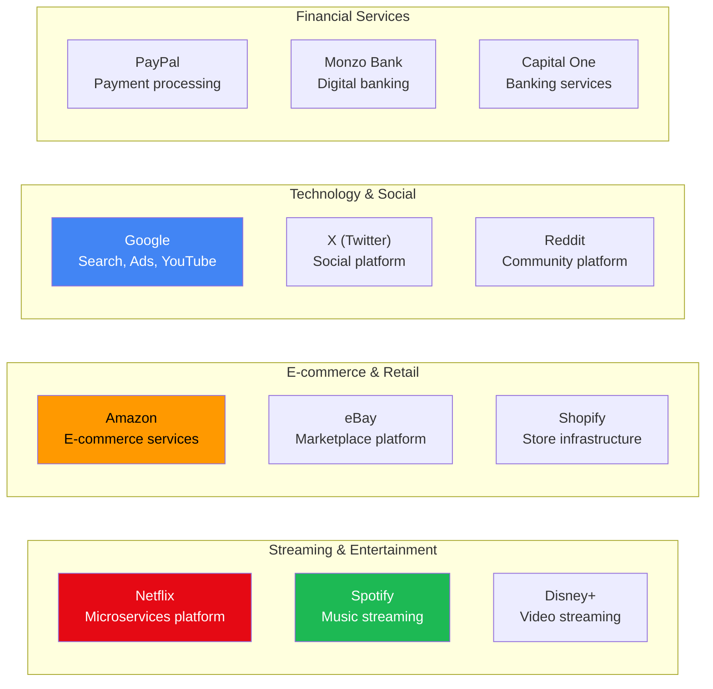
```mermaid
graph LR
    subgraph "Streaming & Entertainment"
        NETFLIX[Netflix<br/>Microservices platform]
        SPOTIFY[Spotify<br/>Music streaming]
        DISNEY[Disney+<br/>Video streaming]
    end

    subgraph "E-commerce & Retail"
        AMAZON[Amazon<br/>E-commerce services]
        EBAY[eBay<br/>Marketplace platform]
        SHOPIFY[Shopify<br/>Store infrastructure]
    end

    subgraph "Technology & Social"
        GOOGLE[Google<br/>Search, Ads, YouTube]
        TWITTER["X (Twitter)<br/>Social platform"]
        REDDIT[Reddit<br/>Community platform]
    end

    subgraph "Financial Services"
        PAYPAL[PayPal<br/>Payment processing]
        MONZO[Monzo Bank<br/>Digital banking]
        CAPITAL[Capital One<br/>Banking services]
    end

    style NETFLIX fill:#e50914,color:#fff
    style SPOTIFY fill:#1db954,color:#fff
    style GOOGLE fill:#4285f4,color:#fff
    style AMAZON fill:#ff9900,color:#000
```

#### Real-World Kubernetes Usage Examples

| Company | Scale | Use Case |
|---------|-------|----------|
| **Google** | Billions of containers per week | Runs Gmail, Search, YouTube, Google Maps on Kubernetes-like systems (Borg → Kubernetes) |
| **Spotify** | 300+ microservices | Entire music streaming platform runs on Kubernetes across multiple cloud providers |
| **Airbnb** | 1000+ services | Migrated from monolith to 1000+ microservices on Kubernetes |
| **Uber** | 4000+ microservices | Ride-sharing, food delivery, and logistics platforms |
| **Pinterest** | Hundreds of services | Serves 450+ million users with K8s-based infrastructure |
| **The New York Times** | Cloud-native publishing | Moved entire digital infrastructure to Kubernetes on GCP |
| **Shopify** | Black Friday traffic | Handles massive e-commerce traffic spikes with K8s auto-scaling |
| **Reddit** | 1.7 billion monthly visits | Entire platform runs on Kubernetes for reliability and scaling |

#### Why These Companies Choose Kubernetes

1. **Portability**: Run anywhere (on-premises, cloud, hybrid)
2. **Scalability**: Handle millions of users with auto-scaling
3. **Resilience**: Self-healing and high availability
4. **Cost Efficiency**: Better resource utilization
5. **Developer Productivity**: Standardized deployment processes
6. **Vendor Independence**: Avoid cloud provider lock-in

#### References

1. **AWS EKS**: Amazon Web Services. (2024). "Amazon Elastic Kubernetes Service (EKS)". https://aws.amazon.com/eks/
2. **Google GKE**: Google Cloud. (2024). "Google Kubernetes Engine (GKE)". https://cloud.google.com/kubernetes-engine
3. **Azure AKS**: Microsoft Azure. (2024). "Azure Kubernetes Service (AKS)". https://azure.microsoft.com/en-us/products/kubernetes-service
4. **Kubernetes Origins**: Burns, B., et al. (2016). "Borg, Omega, and Kubernetes". ACM Queue, 14(1). https://queue.acm.org/detail.cfm?id=2898444
5. **Spotify Case Study**: CNCF. (2021). "Spotify Case Study". https://www.cncf.io/case-studies/spotify/
6. **Airbnb Case Study**: CNCF. (2019). "Airbnb Case Study". https://www.cncf.io/case-studies/airbnb/
7. **New York Times**: CNCF. (2020). "The New York Times Case Study". https://www.cncf.io/case-studies/the-new-york-times/
8. **Reddit Infrastructure**: Reddit Engineering Blog. (2023). "How Reddit Serves Billions". https://www.redditinc.com/blog
9. **Shopify at Scale**: Shopify Engineering. (2023). "Black Friday Cyber Monday". https://shopify.engineering/
10. **CNCF Adopters**: Cloud Native Computing Foundation. (2024). "Kubernetes Adopters". https://www.cncf.io/projects/kubernetes/

---

## Key Kubernetes Concepts

This demo showcases the following Kubernetes resources:

### 1. Namespace

| Aspect | Description |
|--------|-------------|
| **What** | Logical isolation for resources within a cluster |
| **Why** | Organize resources, apply policies, and resource quotas |
| **Docker Equivalent** | Docker networks (`docker network create`) - isolate containers |
| **File** | `k8s/base/00-namespace.yaml` |

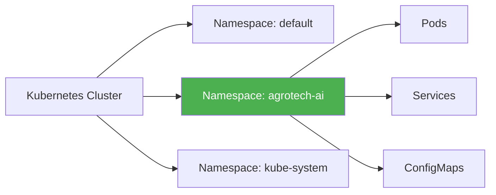
```mermaid
graph LR
    CLUSTER[Kubernetes Cluster]
    NS1[Namespace: default]
    NS2[Namespace: agrotech-ai]
    NS3[Namespace: kube-system]

    CLUSTER --> NS1
    CLUSTER --> NS2
    CLUSTER --> NS3

    NS2 --> PODS[Pods]
    NS2 --> SVC[Services]
    NS2 --> CM[ConfigMaps]

    style NS2 fill:#4caf50,color:#fff
```

```yaml
apiVersion: v1
kind: Namespace
metadata:
  name: agrotech-ai
```

**Demo talking points**:
- Namespaces prevent resource name conflicts
- Enable multi-tenancy in a single cluster
- Apply RBAC (Role-Based Access Control) per namespace

---

### 2. ConfigMap

| Aspect | Description |
|--------|-------------|
| **What** | Store non-sensitive configuration data as key-value pairs |
| **Why** | Decouple configuration from container images |
| **Docker Equivalent** | Environment variables (`docker run -e`) or config files (`-v ./config:/app/config`) |
| **File** | `k8s/base/01-configmap.yaml` |

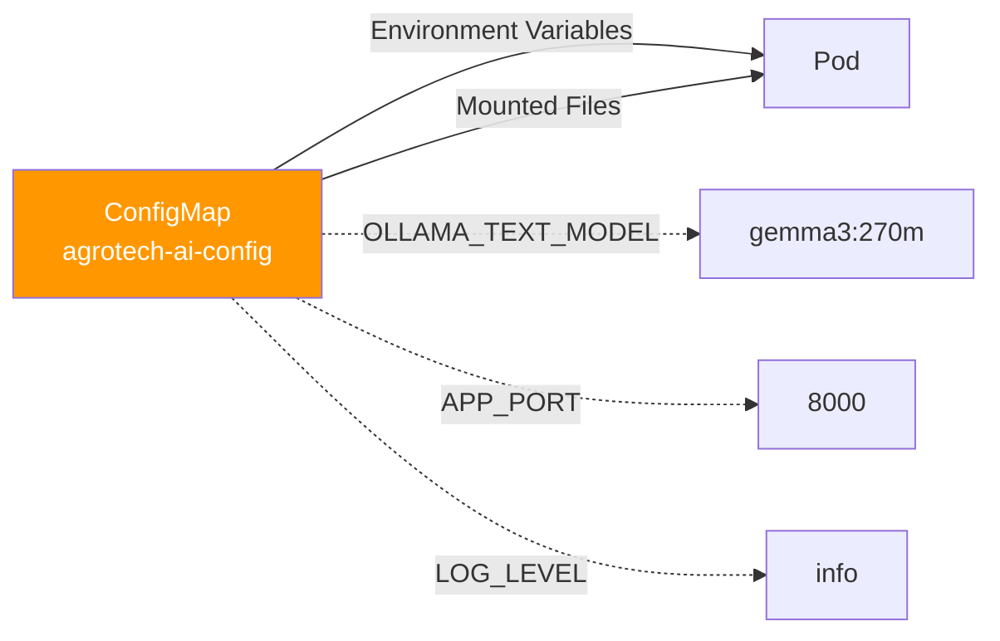
```mermaid
graph LR
    CM[ConfigMap<br/>agrotech-ai-config]
    POD[Pod]

    CM -->|Environment Variables| POD
    CM -->|Mounted Files| POD

    CM -.->|OLLAMA_TEXT_MODEL| ENV1[gemma3:270m]
    CM -.->|APP_PORT| ENV2[8000]
    CM -.->|LOG_LEVEL| ENV3[info]

    style CM fill:#ff9800,color:#fff
```

```yaml
apiVersion: v1
kind: ConfigMap
metadata:
  name: agrotech-ai-config
data:
  OLLAMA_TEXT_MODEL: "gemma3:270m"
  APP_PORT: "8000"
```

**Demo talking points**:
- Makes applications portable across environments
- Can be mounted as files or environment variables
- Changes can trigger pod restarts (with proper configuration)

---

### 3. Secret

| Aspect | Description |
|--------|-------------|
| **What** | Store sensitive data (passwords, tokens, keys) |
| **Why** | Keep sensitive information separate from application code |
| **Docker Equivalent** | Docker secrets (`docker secret create`) or environment variables (`-e`) |
| **File** | `k8s/base/02-secret.yaml` |

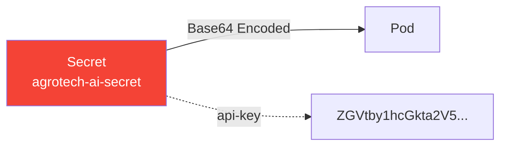
```mermaid
graph LR
    SECRET[Secret<br/>agrotech-ai-secret]
    POD[Pod]

    SECRET -->|Base64 Encoded| POD

    SECRET -.->|api-key| KEY[ZGVtby1hcGkta2V5...]

    style SECRET fill:#f44336,color:#fff
```

```yaml
apiVersion: v1
kind: Secret
type: Opaque
data:
  api-key: ZGVtby1hcGkta2V5LTEyMzQ1  # base64 encoded
```

**Demo talking points**:
- Data is base64 encoded (NOT encrypted by default)
- Production: Use encryption at rest and external secret managers
- Can be mounted as files or environment variables

**Encode/Decode secrets**:
```bash
# Encode
echo -n "my-secret-value" | base64

# Decode
echo "bXktc2VjcmV0LXZhbHVl" | base64 -d
```

---

### 4. PersistentVolume (PV) & PersistentVolumeClaim (PVC)

| Aspect | Description |
|--------|-------------|
| **What** | Provides persistent storage that survives pod restarts |
| **Why** | Applications need data persistence |
| **Docker Equivalent** | Docker volumes (`docker volume create` & `docker run -v volume_name:/path`) |
| **File** | `k8s/base/03-persistentvolume.yaml` |

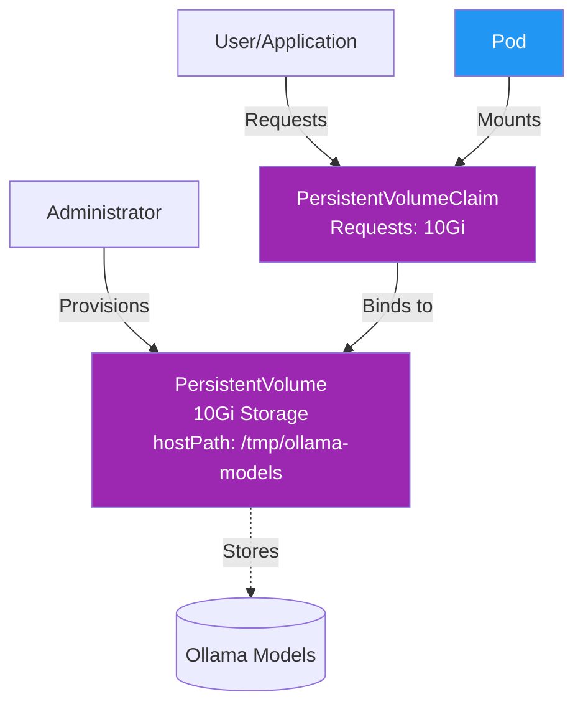
```mermaid
graph TB
    ADMIN[Administrator]
    USER[User/Application]

    ADMIN -->|Provisions| PV[PersistentVolume<br/>10Gi Storage<br/>hostPath: /tmp/ollama-models]
    USER -->|Requests| PVC[PersistentVolumeClaim<br/>Requests: 10Gi]

    PVC -->|Binds to| PV
    POD[Pod] -->|Mounts| PVC

    PV -.->|Stores| DATA[(Ollama Models)]

    style PV fill:#9c27b0,color:#fff
    style PVC fill:#9c27b0,color:#fff
    style POD fill:#2196f3,color:#fff
```

```yaml
# PV - Cluster-level storage resource
apiVersion: v1
kind: PersistentVolume
metadata:
  name: ollama-models-pv
spec:
  capacity:
    storage: 10Gi
  accessModes:
    - ReadWriteOnce
---
# PVC - User's request for storage
apiVersion: v1
kind: PersistentVolumeClaim
metadata:
  name: ollama-models-pvc
spec:
  resources:
    requests:
      storage: 10Gi
```

**Demo talking points**:
- PV = admin-provisioned storage
- PVC = user/pod request for storage
- Lifecycle independent of pods
- Access modes: ReadWriteOnce, ReadOnlyMany, ReadWriteMany

**Our use case**: Store Ollama AI models so they persist across pod restarts

---

### 5. Deployment

| Aspect | Description |
|--------|-------------|
| **What** | Manages a set of identical pods (ReplicaSets) |
| **Why** | Ensures desired number of pods are running, handles updates |
| **Docker Equivalent** | Docker Compose `replicas` or manually running multiple containers |
| **File** | `k8s/base/04-deployment.yaml` |

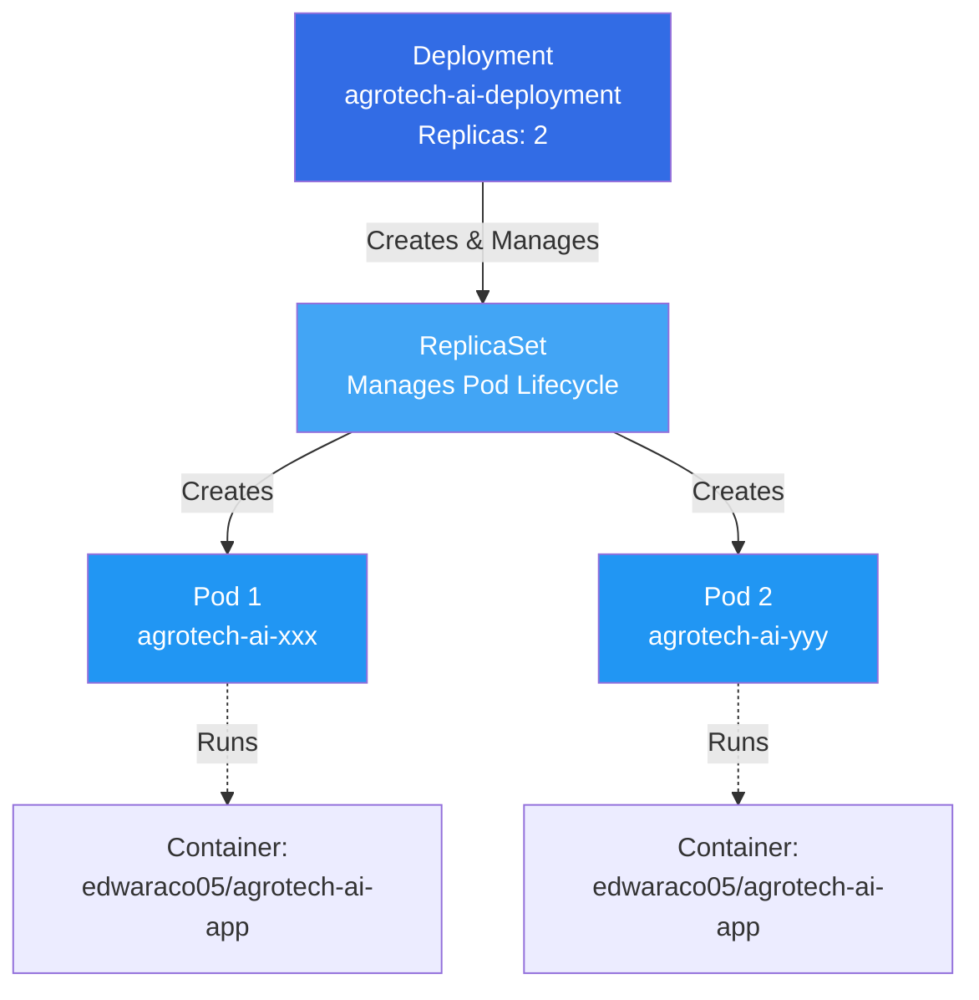
```mermaid
graph TB
    DEPLOY[Deployment<br/>agrotech-ai-deployment<br/>Replicas: 2]

    RS[ReplicaSet<br/>Manages Pod Lifecycle]

    POD1[Pod 1<br/>agrotech-ai-xxx]
    POD2[Pod 2<br/>agrotech-ai-yyy]

    DEPLOY -->|Creates & Manages| RS
    RS -->|Creates| POD1
    RS -->|Creates| POD2

    POD1 -.->|Runs| CONTAINER1[Container:<br/>edwaraco05/agrotech-ai-app]
    POD2 -.->|Runs| CONTAINER2[Container:<br/>edwaraco05/agrotech-ai-app]

    style DEPLOY fill:#326ce5,color:#fff
    style RS fill:#42a5f5,color:#fff
    style POD1 fill:#2196f3,color:#fff
    style POD2 fill:#2196f3,color:#fff
```

```yaml
apiVersion: apps/v1
kind: Deployment
metadata:
  name: agrotech-ai-deployment
spec:
  replicas: 2  # Desired number of pods
  strategy:
    type: RollingUpdate  # Zero-downtime updates
  template:
    spec:
      containers:
      - name: agrotech-ai
        image: edwaraco05/agrotech-ai-app:latest
        resources:
          requests:
            memory: "4Gi"
            cpu: "1000m"
          limits:
            memory: "8Gi"
            cpu: "2000m"
```

**Demo talking points**:
- Declarative: "I want 2 replicas" vs "start 2 containers"
- Self-healing: Automatically replaces failed pods
- Rolling updates: Update without downtime
- Rollback support: Easily revert to previous version

---

### 6. Probes (Health Checks)

| Aspect | Description |
|--------|-------------|
| **What** | Monitor container health and readiness |
| **Why** | Ensure traffic only goes to healthy pods |
| **Docker Equivalent** | Docker HEALTHCHECK instruction in Dockerfile |
| **File** | `k8s/base/04-deployment.yaml` (within Deployment) |

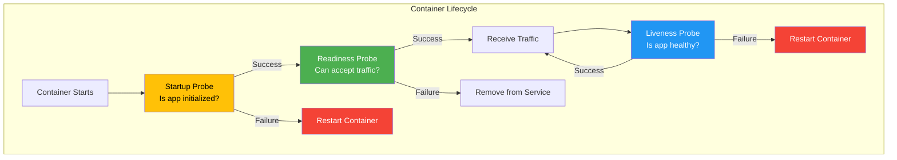
```mermaid
graph TB
    subgraph "Container Lifecycle"
        START[Container Starts]
        STARTUP[Startup Probe<br/>Is app initialized?]
        READY[Readiness Probe<br/>Can accept traffic?]
        LIVE[Liveness Probe<br/>Is app healthy?]

        START --> STARTUP
        STARTUP -->|Success| READY
        STARTUP -->|Failure| RESTART1[Restart Container]

        READY -->|Success| TRAFFIC[Receive Traffic]
        READY -->|Failure| REMOVE[Remove from Service]

        TRAFFIC --> LIVE
        LIVE -->|Success| TRAFFIC
        LIVE -->|Failure| RESTART2[Restart Container]
    end

    style STARTUP fill:#ffc107,color:#000
    style READY fill:#4caf50,color:#fff
    style LIVE fill:#2196f3,color:#fff
    style RESTART1 fill:#f44336,color:#fff
    style RESTART2 fill:#f44336,color:#fff
```

```yaml
livenessProbe:   # Restart unhealthy containers
  httpGet:
    path: /health
    port: 8000
  initialDelaySeconds: 60
  periodSeconds: 30

readinessProbe:  # Control traffic routing
  httpGet:
    path: /health
    port: 8000
  initialDelaySeconds: 45
  periodSeconds: 10

startupProbe:    # For slow-starting apps
  httpGet:
    path: /health
    port: 8000
  failureThreshold: 12
```

**Demo talking points**:
- **Liveness**: "Is the app alive?" → Restart if fails
- **Readiness**: "Can the app handle traffic?" → Remove from load balancer if fails
- **Startup**: "Has the app finished starting?" → Prevents premature liveness checks

---

### 7. Service

| Aspect | Description |
|--------|-------------|
| **What** | Stable network endpoint for accessing pods |
| **Why** | Pods are ephemeral, Services provide stable access |
| **Docker Equivalent** | Port publishing (`docker run -p 8080:80`) or Docker Compose `ports` |
| **File** | `k8s/base/05-service.yaml` |

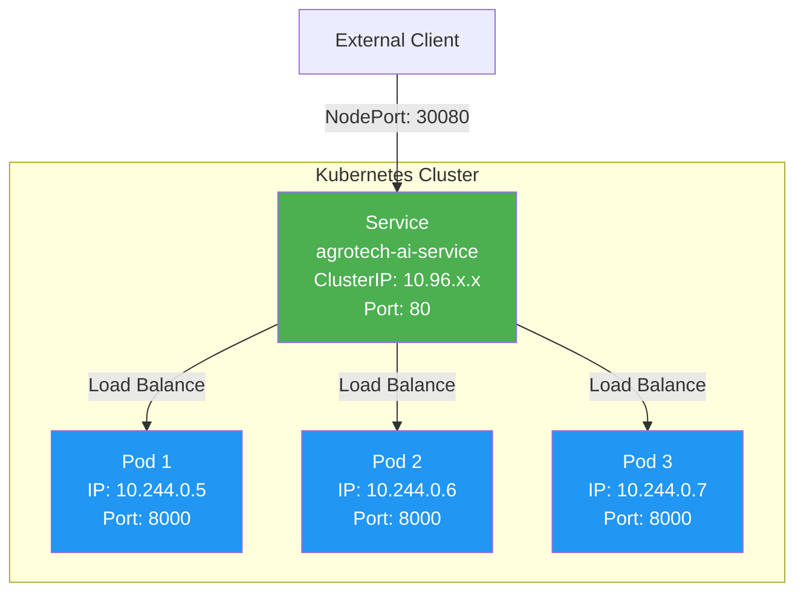
```mermaid
graph TB
    CLIENT[External Client]

    subgraph "Kubernetes Cluster"
        SVC[Service<br/>agrotech-ai-service<br/>ClusterIP: 10.96.x.x<br/>Port: 80]

        POD1[Pod 1<br/>IP: 10.244.0.5<br/>Port: 8000]
        POD2[Pod 2<br/>IP: 10.244.0.6<br/>Port: 8000]
        POD3[Pod 3<br/>IP: 10.244.0.7<br/>Port: 8000]
    end

    CLIENT -->|NodePort: 30080| SVC
    SVC -->|Load Balance| POD1
    SVC -->|Load Balance| POD2
    SVC -->|Load Balance| POD3

    style SVC fill:#4caf50,color:#fff
    style POD1 fill:#2196f3,color:#fff
    style POD2 fill:#2196f3,color:#fff
    style POD3 fill:#2196f3,color:#fff
```

**Service Types**:

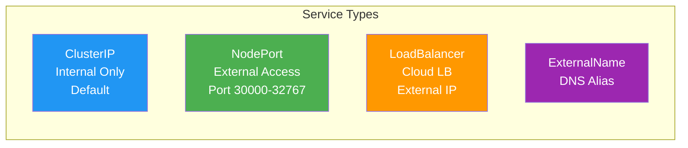
```mermaid
graph LR
    subgraph "Service Types"
        CIP[ClusterIP<br/>Internal Only<br/>Default]
        NP[NodePort<br/>External Access<br/>Port 30000-32767]
        LB[LoadBalancer<br/>Cloud LB<br/>External IP]
        EN[ExternalName<br/>DNS Alias]
    end

    style CIP fill:#2196f3,color:#fff
    style NP fill:#4caf50,color:#fff
    style LB fill:#ff9800,color:#fff
    style EN fill:#9c27b0,color:#fff
```

```yaml
apiVersion: v1
kind: Service
metadata:
  name: agrotech-ai-service
spec:
  type: NodePort
  selector:
    app: agrotech-ai
  ports:
  - port: 80
    targetPort: 8000
    nodePort: 30080
```

**Demo talking points**:
- Services provide DNS names: `agrotech-ai-service.agrotech-ai.svc.cluster.local`
- Load balancing across pod replicas
- Session affinity for WebSocket support

---

### 8. Ingress

| Aspect | Description |
|--------|-------------|
| **What** | HTTP/HTTPS routing to services |
| **Why** | Single entry point for multiple services |
| **Docker Equivalent** | Nginx/Traefik reverse proxy container or Docker Compose with gateway |
| **File** | `k8s/base/06-ingress.yaml` |

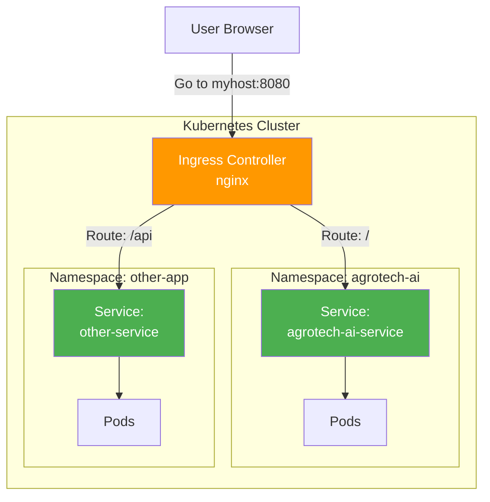
```mermaid
graph TB
    USER[User Browser]

    subgraph "Kubernetes Cluster"
        INGRESS[Ingress Controller<br/>nginx]

        subgraph "Namespace: agrotech-ai"
            SVC1[Service:<br/>agrotech-ai-service]
            POD1[Pods]
        end

        subgraph "Namespace: other-app"
            SVC2[Service:<br/>other-service]
            POD2[Pods]
        end
    end

    USER -->|"Go to myhost:8080"| INGRESS
    INGRESS -->|Route: /| SVC1
    INGRESS -->|Route: /api| SVC2
    SVC1 --> POD1
    SVC2 --> POD2

    style INGRESS fill:#ff9800,color:#fff
    style SVC1 fill:#4caf50,color:#fff
    style SVC2 fill:#4caf50,color:#fff
```

```yaml
apiVersion: networking.k8s.io/v1
kind: Ingress
metadata:
  name: agrotech-ai-ingress
spec:
  rules:
  - http:
      paths:
      - path: /
        backend:
          service:
            name: agrotech-ai-service
            port:
              number: 80
```

**Demo talking points**:
- Requires Ingress Controller (nginx, traefik, etc.)
- Path-based and host-based routing
- SSL/TLS termination
- Centralized routing rules

---

### 9. Connecting to External Services (Databases, APIs)

| Aspect | Description |
|--------|-------------|
| **What** | Methods to connect Kubernetes pods to external services outside the cluster |
| **Why** | Applications often need databases, APIs, or cloud services not running in Kubernetes |
| **Docker Equivalent** | Using external host addresses or `--add-host` flag |
| **Common Use Cases** | External PostgreSQL/MySQL, Cloud databases (AWS RDS), Third-party APIs |

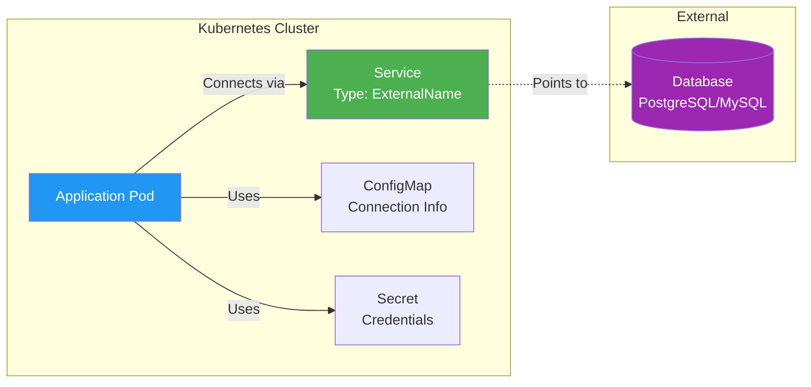
```mermaid
graph LR
    subgraph "Kubernetes Cluster"
        POD[Application Pod]
        SVC[Service<br/>Type: ExternalName]
        CM[ConfigMap<br/>Connection Info]
        SECRET[Secret<br/>Credentials]
    end

    subgraph "External"
        DB[(Database<br/>PostgreSQL/MySQL)]
    end

    POD -->|Uses| CM
    POD -->|Uses| SECRET
    POD -->|Connects via| SVC
    SVC -.->|Points to| DB

    style POD fill:#2196f3,color:#fff
    style SVC fill:#4caf50,color:#fff
    style DB fill:#9c27b0,color:#fff
```

#### Three Main Approaches

**1. ExternalName Service (DNS-based)**
```yaml
apiVersion: v1
kind: Service
metadata:
  name: external-database
spec:
  type: ExternalName
  externalName: postgres.mycompany.com  # External hostname
```
- Pods use service name: `external-database`
- Kubernetes resolves it to the external hostname
- Simple and clean DNS abstraction

**2. Service + Endpoints (IP-based)**
```yaml
apiVersion: v1
kind: Service
metadata:
  name: external-db
spec:
  ports:
  - port: 5432
---
apiVersion: v1
kind: Endpoints
metadata:
  name: external-db
subsets:
- addresses:
  - ip: 192.168.1.100  # External database IP
  ports:
  - port: 5432
```
- Use when you have IP address instead of DNS
- Kubernetes routes traffic to specified IP

**3. ConfigMap + Secret (Store connection details)**
```yaml
# Non-sensitive configuration
apiVersion: v1
kind: ConfigMap
metadata:
  name: db-config
data:
  DB_HOST: "postgres.example.com"
  DB_PORT: "5432"
  DB_NAME: "myapp_db"
---
# Sensitive credentials
apiVersion: v1
kind: Secret
metadata:
  name: db-secret
stringData:
  username: "dbuser"
  password: "securepassword"
```

**Using in Deployment:**
```yaml
spec:
  containers:
  - name: app
    env:
    - name: DB_HOST
      valueFrom:
        configMapKeyRef:
          name: db-config
          key: DB_HOST
    - name: DB_PASSWORD
      valueFrom:
        secretKeyRef:
          name: db-secret
          key: password
```

#### Quick Comparison

| Method | Best For | Pros | Cons |
|--------|----------|------|------|
| **ExternalName** | External DB with hostname | Simple, DNS-based | Requires DNS name |
| **Endpoints** | External DB with IP only | Works with IPs | Manual management |
| **ConfigMap + Secret** | Any external service | Flexible, portable | App must read env vars |

**Demo talking points**:
- External services live outside Kubernetes cluster
- Use ExternalName for DNS-based connections (most common)
- Store credentials in Secrets, configuration in ConfigMaps
- Application code stays the same across environments
- Cloud databases (AWS RDS, Azure SQL) work the same way

---

### 10. HorizontalPodAutoscaler (HPA)

| Aspect | Description |
|--------|-------------|
| **What** | Automatically scales pods based on metrics |
| **Why** | Handle varying loads efficiently |
| **Docker Equivalent** | No direct equivalent - manual scaling or external tools like Docker Swarm autoscaling |
| **File** | `k8s/base/07-hpa.yaml` |

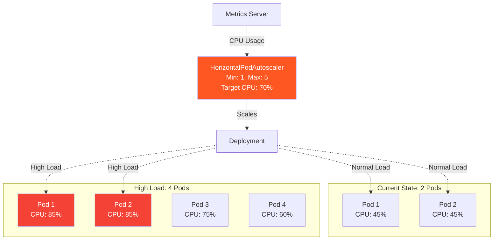
```mermaid
graph TB
    HPA[HorizontalPodAutoscaler<br/>Min: 1, Max: 5<br/>Target CPU: 70%]
    METRICS[Metrics Server]
    DEPLOY[Deployment]

    subgraph "Current State: 2 Pods"
        POD1[Pod 1<br/>CPU: 45%]
        POD2[Pod 2<br/>CPU: 45%]
    end

    subgraph "High Load: 4 Pods"
        POD3[Pod 1<br/>CPU: 85%]
        POD4[Pod 2<br/>CPU: 85%]
        POD5[Pod 3<br/>CPU: 75%]
        POD6[Pod 4<br/>CPU: 60%]
    end

    METRICS -->|CPU Usage| HPA
    HPA -->|Scales| DEPLOY
    DEPLOY -.->|Normal Load| POD1
    DEPLOY -.->|Normal Load| POD2
    DEPLOY -.->|High Load| POD3
    DEPLOY -.->|High Load| POD4

    style HPA fill:#ff5722,color:#fff
    style POD3 fill:#f44336,color:#fff
    style POD4 fill:#f44336,color:#fff
```

```yaml
apiVersion: autoscaling/v2
kind: HorizontalPodAutoscaler
metadata:
  name: agrotech-ai-hpa
spec:
  minReplicas: 1
  maxReplicas: 5
  metrics:
  - type: Resource
    resource:
      name: cpu
      target:
        averageUtilization: 70  # Scale when CPU > 70%
```

**Demo talking points**:
- Requires metrics-server
- Scales based on CPU, memory, or custom metrics
- Prevents over-provisioning and under-provisioning
- Cost optimization in cloud environments

---

## Demo Setup Prerequisites

### Required Tools
1. **kubectl** - Kubernetes command-line tool
   ```bash
   # Install kubectl
   curl -LO "https://dl.k8s.io/release/$(curl -L -s https://dl.k8s.io/release/stable.txt)/bin/linux/amd64/kubectl"
   chmod +x kubectl
   sudo mv kubectl /usr/local/bin/
   ```

2. **minikube** - Local Kubernetes cluster
   ```bash
   # Install minikube
   curl -LO https://storage.googleapis.com/minikube/releases/latest/minikube-linux-amd64
   sudo install minikube-linux-amd64 /usr/local/bin/minikube
   ```

3. **Docker** - Container runtime
   ```bash
   # Verify Docker is installed
   docker --version
   ```

### Verify Installation
```bash
kubectl version --client
minikube version
```

---

## Quick Start Demo

### 1. Start Minikube Cluster
```bash
# Start minikube with sufficient resources
minikube start --cpus=4 --memory=12288 --disk-size=40g

# Verify cluster is running
kubectl cluster-info
kubectl get nodes
```

### 2. Deploy AgroTech AI (All-in-One)

#### 1. In a separate terminal, run:

```bash
minikube tunnel
```

This will assign an `EXTERNAL-IP` to your LoadBalancer service

#### 2. Apply the updated all-in-one setup

```bash
kubectl apply -f k8s/all-in-one.yaml
```

#### 3. Watch pods come up

```bash
kubectl get pods -n agrotech-ai -w
```

#### 4. Check the service (should show EXTERNAL-IP)

```bash
kubectl get svc -n agrotech-ai
```

#### 5. If you apply some changes in you all-in-one file, then you can apply the updated manifest: 

```bash
kubectl delete -f k8s/all-in-one.yaml
```

and repeat from the step 2 again


### 3. Access the Application
```bash
# Get minikube IP
minikube ip

# Then open in your browser:
# http://<minikube-ip>:30080

# Or use port-forward for easier access:
kubectl port-forward -n agrotech-ai svc/agrotech-ai-service 8080:80
# Then open: http://localhost:8080
```

### 4. Check Deployment Status
```bash
# View all resources
kubectl get all -n agrotech-ai

# Check pod logs
kubectl logs -n agrotech-ai -l app=agrotech-ai -f

# Describe pod for detailed info
kubectl describe pod -n agrotech-ai <pod-name>
```

---

## Detailed Walkthrough

### Step-by-Step Deployment (Individual Manifests)

This demonstrates applying resources incrementally:

```bash
# 1. Create namespace
kubectl apply -f k8s/base/00-namespace.yaml
kubectl get namespaces

# 2. Create ConfigMap
kubectl apply -f k8s/base/01-configmap.yaml
kubectl get configmap -n agrotech-ai
kubectl describe configmap agrotech-ai-config -n agrotech-ai

# 3. Create Secret
kubectl apply -f k8s/base/02-secret.yaml
kubectl get secrets -n agrotech-ai
kubectl describe secret agrotech-ai-secret -n agrotech-ai

# 4. Create PersistentVolume and PVC
kubectl apply -f k8s/base/03-persistentvolume.yaml
kubectl get pv
kubectl get pvc -n agrotech-ai

# 5. Create Deployment
kubectl apply -f k8s/base/04-deployment.yaml
kubectl get deployments -n agrotech-ai
kubectl rollout status deployment/agrotech-ai-deployment -n agrotech-ai

# 6. Create Service
kubectl apply -f k8s/base/05-service.yaml
kubectl get services -n agrotech-ai

# 7. (Optional) Create Ingress
# Requires: minikube addons enable ingress
kubectl apply -f k8s/base/06-ingress.yaml
kubectl get ingress -n agrotech-ai

# 8. (Optional) Create HPA
# Requires: minikube addons enable metrics-server
kubectl apply -f k8s/base/07-hpa.yaml
kubectl get hpa -n agrotech-ai
```

---

## Live Demonstrations

### Demo 1: Self-Healing
**Concept**: Kubernetes automatically restarts failed containers

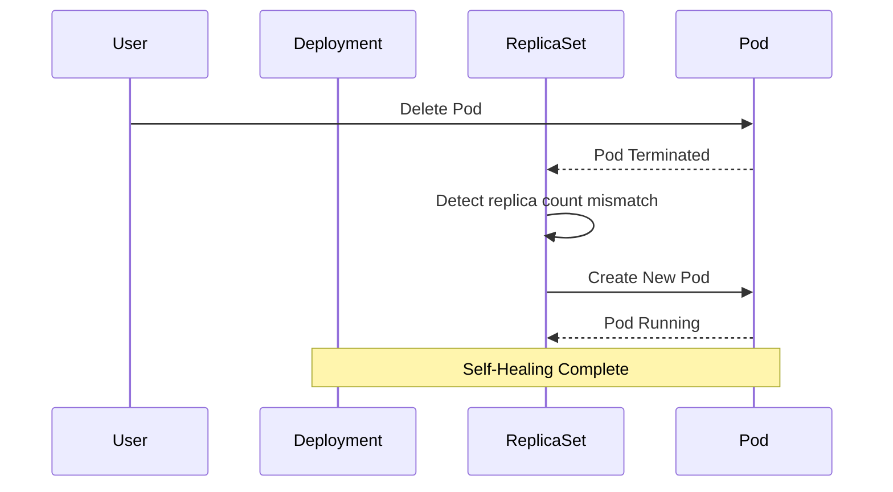
```mermaid
sequenceDiagram
    participant User
    participant Deployment
    participant ReplicaSet
    participant Pod

    User->>Pod: Delete Pod
    Pod-->>ReplicaSet: Pod Terminated
    ReplicaSet->>ReplicaSet: Detect replica count mismatch
    ReplicaSet->>Pod: Create New Pod
    Pod-->>ReplicaSet: Pod Running
    Note over Deployment,Pod: Self-Healing Complete
```

```bash
# 1. Check current pods
kubectl get pods -n agrotech-ai

# 2. Delete a pod manually
kubectl delete pod -n agrotech-ai <pod-name>

# 3. Watch Kubernetes recreate it immediately
kubectl get pods -n agrotech-ai -w
```

**Talking points**:
- Deployment controller maintains desired replica count
- Pod deletion triggers automatic replacement
- No manual intervention required

---

### Demo 2: Horizontal Scaling
**Concept**: Easily scale application replicas

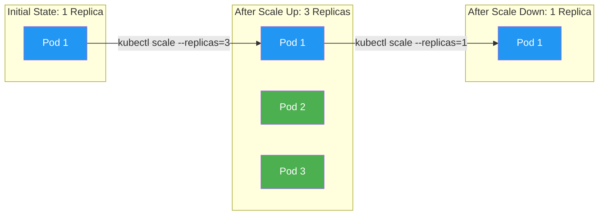
```mermaid
graph LR
    subgraph "Initial State: 1 Replica"
        P1[Pod 1]
    end

    subgraph "After Scale Up: 3 Replicas"
        P2[Pod 1]
        P3[Pod 2]
        P4[Pod 3]
    end

    subgraph "After Scale Down: 1 Replica"
        P5[Pod 1]
    end

    P1 -->|kubectl scale --replicas=3| P2
    P2 -->|kubectl scale --replicas=1| P5

    style P1 fill:#2196f3,color:#fff
    style P2 fill:#2196f3,color:#fff
    style P3 fill:#4caf50,color:#fff
    style P4 fill:#4caf50,color:#fff
    style P5 fill:#2196f3,color:#fff
```

```bash
# 1. Check current replicas
kubectl get deployment -n agrotech-ai

# 2. Scale up to 3 replicas
kubectl scale deployment agrotech-ai-deployment --replicas=3 -n agrotech-ai

# 3. Watch new pods being created
kubectl get pods -n agrotech-ai -w

# 4. Scale down to 1
kubectl scale deployment agrotech-ai-deployment --replicas=1 -n agrotech-ai
```

**Talking points**:
- Declarative scaling
- Load balanced automatically across replicas
- Service continues working without changes

---

### Demo 3: Rolling Updates
**Concept**: Update application with zero downtime

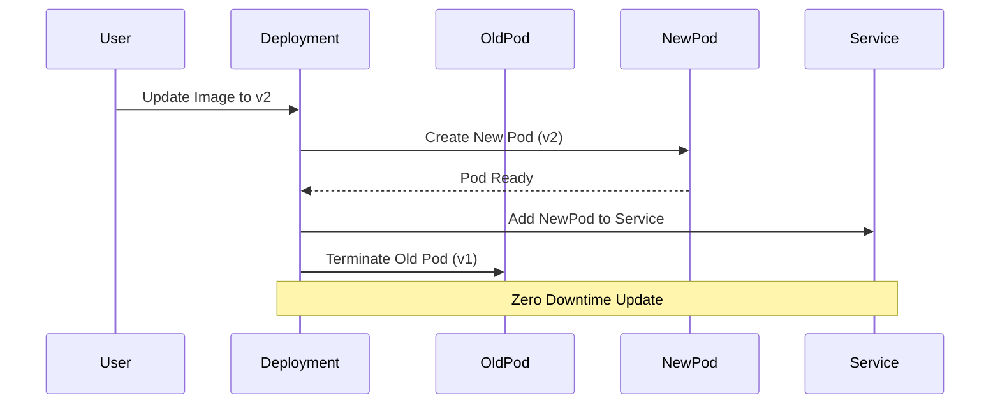
```mermaid
sequenceDiagram
    participant User
    participant Deployment
    participant OldPod
    participant NewPod
    participant Service

    User->>Deployment: Update Image to v2
    Deployment->>NewPod: Create New Pod (v2)
    NewPod-->>Deployment: Pod Ready
    Deployment->>Service: Add NewPod to Service
    Deployment->>OldPod: Terminate Old Pod (v1)
    Note over Deployment,Service: Zero Downtime Update
```

```bash
# 1. Check current image
kubectl describe deployment agrotech-ai-deployment -n agrotech-ai | grep Image

# 2. Update to a new image version (demo purposes)
kubectl set image deployment/agrotech-ai-deployment \
  agrotech-ai=edwaraco05/agrotech-ai-app:v2 -n agrotech-ai

# 3. Watch rolling update in progress
kubectl rollout status deployment/agrotech-ai-deployment -n agrotech-ai

# 4. View rollout history
kubectl rollout history deployment/agrotech-ai-deployment -n agrotech-ai

# 5. Rollback if needed
kubectl rollout undo deployment/agrotech-ai-deployment -n agrotech-ai
```

**Talking points**:
- Gradual pod replacement (maxSurge, maxUnavailable)
- Zero downtime deployments
- Easy rollback to previous version

---

### Demo 4: ConfigMap Updates
**Concept**: Update application configuration

```bash
# 1. View current ConfigMap
kubectl get configmap agrotech-ai-config -n agrotech-ai -o yaml

# 2. Edit ConfigMap
kubectl edit configmap agrotech-ai-config -n agrotech-ai
# Change LOG_LEVEL from "info" to "debug"

# 3. Restart pods to pick up new config
kubectl rollout restart deployment/agrotech-ai-deployment -n agrotech-ai

# 4. Verify pods restarted
kubectl get pods -n agrotech-ai
```

**Talking points**:
- ConfigMaps decouple configuration from images
- Changes require pod restart (unless using sidecar patterns)
- Same image works across environments with different configs

---

### Demo 5: Resource Management
**Concept**: View resource usage and limits

```bash
# 1. Enable metrics-server (if not already)
minikube addons enable metrics-server

# 2. Wait a moment for metrics collection, then view pod resource usage
kubectl top pods -n agrotech-ai

# 3. View node resource usage
kubectl top nodes

# 4. Describe pod to see resource requests/limits
kubectl describe pod -n agrotech-ai <pod-name> | grep -A 5 "Limits\|Requests"
```

**Talking points**:
- Requests guarantee minimum resources
- Limits prevent resource hogging
- Critical for multi-tenant clusters

---

### Demo 6: Logs and Debugging
**Concept**: Troubleshooting pods

```bash
# 1. View logs from all pods with label
kubectl logs -n agrotech-ai -l app=agrotech-ai --tail=50

# 2. Follow logs in real-time
kubectl logs -n agrotech-ai -l app=agrotech-ai -f

# 3. View previous container logs (if crashed)
kubectl logs -n agrotech-ai <pod-name> --previous

# 4. Execute command inside running container
kubectl exec -it -n agrotech-ai <pod-name> -- /bin/sh

# 5. Port forward to local machine
kubectl port-forward -n agrotech-ai <pod-name> 8000:8000
```

**Talking points**:
- Centralized logging important for production
- kubectl exec for debugging (avoid in production)
- Port forwarding useful for local development

---

### Demo 7: Service Discovery
**Concept**: DNS-based service discovery

```bash
# 1. Get a shell inside a pod
kubectl exec -it -n agrotech-ai <pod-name> -- /bin/sh

# 2. Inside the pod, test DNS resolution
nslookup agrotech-ai-service
nslookup agrotech-ai-service.agrotech-ai
nslookup agrotech-ai-service.agrotech-ai.svc.cluster.local

# 3. Test connectivity to service
curl http://agrotech-ai-service/health
```

**Talking points**:
- Services automatically get DNS names
- Format: `<service-name>.<namespace>.svc.cluster.local`
- Microservices communicate via service names

---

### Demo 8: Auto-Scaling (HPA)
**Concept**: Automatic scaling based on CPU load

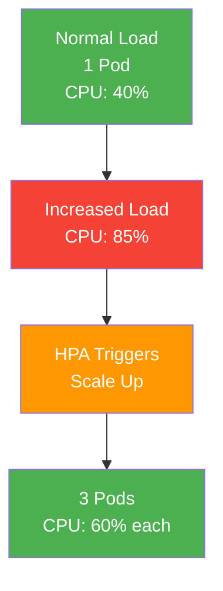
```mermaid
graph TB
    START[Normal Load<br/>1 Pod<br/>CPU: 40%]
    LOAD[Increased Load<br/>CPU: 85%]
    SCALE[HPA Triggers<br/>Scale Up]
    BALANCED[3 Pods<br/>CPU: 60% each]

    START --> LOAD
    LOAD --> SCALE
    SCALE --> BALANCED

    style START fill:#4caf50,color:#fff
    style LOAD fill:#f44336,color:#fff
    style SCALE fill:#ff9800,color:#fff
    style BALANCED fill:#4caf50,color:#fff
```

```bash
# 1. Enable metrics-server
minikube addons enable metrics-server

# 2. Apply HPA
kubectl apply -f k8s/base/07-hpa.yaml

# 3. Check HPA status
kubectl get hpa -n agrotech-ai

# 4. Generate load (in another terminal)
kubectl run -it --rm load-generator --image=busybox -n agrotech-ai -- /bin/sh
# Inside the pod:
while true; do wget -q -O- http://agrotech-ai-service/health; done

# 5. Watch HPA scale up
kubectl get hpa -n agrotech-ai -w

# 6. Stop load and watch scale down
```

**Talking points**:
- Automatic response to load
- Cost optimization
- Requires metrics-server or custom metrics

---

## AgroTech AI Architecture in Kubernetes

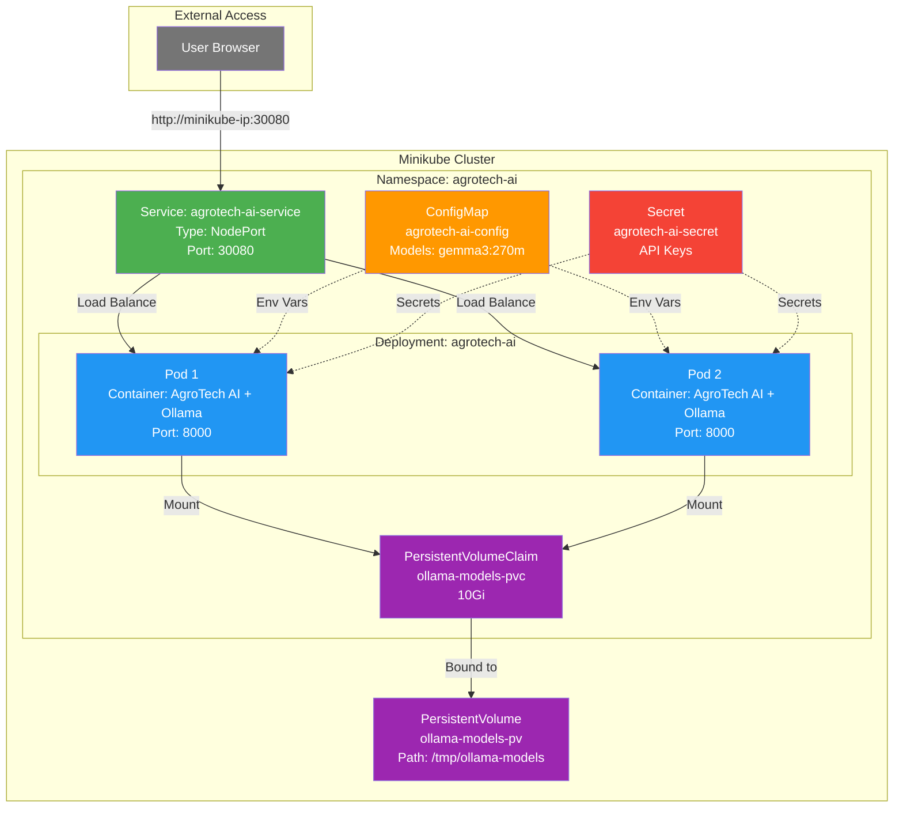
```mermaid
graph TB
    subgraph "External Access"
        USER[User Browser]
    end

    subgraph "Minikube Cluster"
        subgraph "Namespace: agrotech-ai"
            SVC[Service: agrotech-ai-service<br/>Type: NodePort<br/>Port: 30080]

            subgraph "Deployment: agrotech-ai"
                POD1[Pod 1<br/>Container: AgroTech AI + Ollama<br/>Port: 8000]
                POD2[Pod 2<br/>Container: AgroTech AI + Ollama<br/>Port: 8000]
            end

            CM[ConfigMap<br/>agrotech-ai-config<br/>Models: gemma3:270m]
            SECRET[Secret<br/>agrotech-ai-secret<br/>API Keys]
            PVC[PersistentVolumeClaim<br/>ollama-models-pvc<br/>10Gi]
        end

        PV[PersistentVolume<br/>ollama-models-pv<br/>Path: /tmp/ollama-models]
    end

    USER -->|http://minikube-ip:30080| SVC
    SVC -->|Load Balance| POD1
    SVC -->|Load Balance| POD2

    CM -.->|Env Vars| POD1
    CM -.->|Env Vars| POD2
    SECRET -.->|Secrets| POD1
    SECRET -.->|Secrets| POD2

    POD1 -->|Mount| PVC
    POD2 -->|Mount| PVC
    PVC -->|Bound to| PV

    style USER fill:#757575,color:#fff
    style SVC fill:#4caf50,color:#fff
    style POD1 fill:#2196f3,color:#fff
    style POD2 fill:#2196f3,color:#fff
    style CM fill:#ff9800,color:#fff
    style SECRET fill:#f44336,color:#fff
    style PVC fill:#9c27b0,color:#fff
    style PV fill:#9c27b0,color:#fff
```

---

## Troubleshooting

### Common Issues

#### Pods stuck in Pending
```bash
# Check events
kubectl describe pod -n agrotech-ai <pod-name>

# Common causes:
# - Insufficient cluster resources
# - PVC not bound
# - Image pull errors
```

**Solutions**:
```bash
# Check node resources
kubectl describe nodes

# Check PVC status
kubectl get pvc -n agrotech-ai

# Check if image exists
docker pull edwaraco05/agrotech-ai-app:latest
```

---

#### Pods in CrashLoopBackOff
```bash
# View logs
kubectl logs -n agrotech-ai <pod-name>
kubectl logs -n agrotech-ai <pod-name> --previous

# Common causes:
# - Application errors
# - Missing environment variables
# - Health check failures
```

---

#### Service not accessible
```bash
# Check service endpoints
kubectl get endpoints -n agrotech-ai

# Check if pods are ready
kubectl get pods -n agrotech-ai

# Test from within cluster
kubectl run test-pod --image=curlimages/curl -it --rm -- sh
curl http://agrotech-ai-service.agrotech-ai/health
```

---

## Useful Commands Cheat Sheet

### Cluster Management
```bash
# Cluster info
kubectl cluster-info
kubectl get nodes
kubectl describe node <node-name>

# Minikube specific
minikube status
minikube dashboard  # Web UI
minikube ssh        # SSH into minikube VM
minikube logs       # View minikube logs
```

### Resource Management
```bash
# Get resources
kubectl get all -n agrotech-ai
kubectl get pods -n agrotech-ai -o wide
kubectl get services -n agrotech-ai
kubectl get deployments -n agrotech-ai

# Describe resources (detailed info)
kubectl describe pod <pod-name> -n agrotech-ai
kubectl describe deployment <deployment-name> -n agrotech-ai

# Edit resources
kubectl edit deployment <deployment-name> -n agrotech-ai

# Delete resources
kubectl delete pod <pod-name> -n agrotech-ai
kubectl delete -f k8s/all-in-one.yaml
```

### Logs and Debugging
```bash
# View logs
kubectl logs <pod-name> -n agrotech-ai
kubectl logs -f <pod-name> -n agrotech-ai  # Follow
kubectl logs <pod-name> -n agrotech-ai --previous  # Previous container

# Execute commands
kubectl exec -it <pod-name> -n agrotech-ai -- /bin/sh
kubectl exec <pod-name> -n agrotech-ai -- env

# Port forwarding
kubectl port-forward <pod-name> 8000:8000 -n agrotech-ai
kubectl port-forward service/agrotech-ai-service 8000:80 -n agrotech-ai
```

### Monitoring
```bash
# Resource usage
kubectl top nodes
kubectl top pods -n agrotech-ai

# Watch resources
kubectl get pods -n agrotech-ai -w
kubectl get events -n agrotech-ai --watch
```

---

## Cleanup

### Delete All Resources
```bash
# Delete using manifest
kubectl delete -f k8s/all-in-one.yaml

# Or delete namespace (removes everything inside)
kubectl delete namespace agrotech-ai

# Delete PersistentVolume (if needed)
kubectl delete pv ollama-models-pv
```

### Stop Minikube
```bash
# Stop cluster (preserves state)
minikube stop

# Delete cluster (removes everything)
minikube delete
```

---

### Demo Flow Recommendation

```bash
# 1. Show empty cluster
kubectl get all -A

# 2. Deploy app
kubectl apply -f k8s/all-in-one.yaml

# 3. Watch it come up
kubectl get pods -n agrotech-ai -w

# 4. Show all resources created
kubectl get all -n agrotech-ai

# 5. Access the app, open in a different terminal to get the external IP
minikube tunnel

# 6. Get the External IP
kubectl get svc -n agrotech-ai

#  http://<EXTERNAL_IP> in browser

# 7. Demo self-healing
kubectl delete pod -n agrotech-ai <pod-name>
kubectl get pods -n agrotech-ai -w

# 8. Demo scaling
kubectl scale deployment agrotech-ai --replicas=3 -n agrotech-ai
kubectl get pods -n agrotech-ai -w

# 9. Show logs
kubectl logs -n agrotech-ai -l app=agrotech-ai --tail=20

# 10. Cleanup
kubectl delete namespace agrotech-ai

# 11. Open Kubernet Dashboard
minikube dashboard &
```

---

## Additional Resources

### Official Documentation
- Kubernetes Docs: https://kubernetes.io/docs/
- kubectl Cheat Sheet: https://kubernetes.io/docs/reference/kubectl/cheatsheet/
- Minikube Docs: https://minikube.sigs.k8s.io/docs/

### Learning Resources
- Kubernetes Interactive Tutorials: https://kubernetes.io/docs/tutorials/
- Play with Kubernetes: https://labs.play-with-k8s.com/

### Best Practices
- Resource Requests and Limits: https://kubernetes.io/docs/concepts/configuration/manage-resources-containers/
- Health Checks: https://kubernetes.io/docs/tasks/configure-pod-container/configure-liveness-readiness-startup-probes/
- Production Checklist: https://kubernetes.io/docs/concepts/cluster-administration/manage-deployment/


